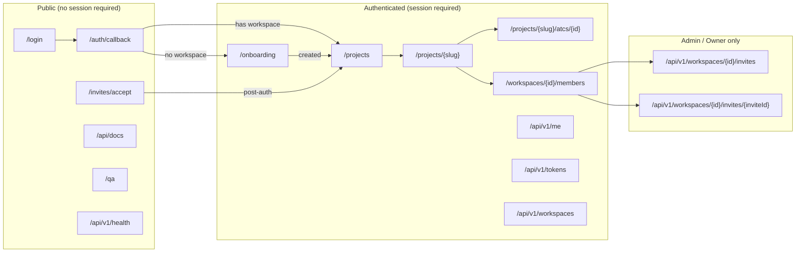

```mermaid
flowchart LR
    A[Authenticated user: /workspaces/id/members or settings] --> B{PAT management UI?}
    B -- Gap: no UI found --> C[POST /api/v1/tokens via direct API call]
    C --> D{Session cookie present?}
    D -- No --> E[401 Unauthorized]
    D -- Yes --> F[Validate body: name, scopes, workspace_id, expires_in_days]
    F --> G[Generate bk_pat_ secret - 32 random bytes]
    G --> H[Insert access_tokens row]
    H --> I[Insert SHA-256 hash in access_token_secrets]
    I --> J[Return: id + raw token bk_pat_prefix.secret]
    J --> K[User stores token - shown ONCE]

    K --> L[CI pipeline: GET /api/v1/me]
    L --> M[Authorization: Bearer bk_pat_...]
    M --> N[requireAuth resolves token from hash]
    N --> O[Validate scopes for requested operation]
    O --> P{Scope granted?}
    P -- No --> Q[403 Insufficient scope]
    P -- Yes --> R[Return user + workspaces + active_workspace_id]
```

# User Journeys — Bunkai TMS

> Phase 2 PRD document. Journeys derived from source code — routes, server actions, API handlers, and components.
> Sibling docs: `executive-summary.md`, `user-personas.md`.
> Personas: see `user-personas.md` for full role definitions.

---

## 1. Route Map

### Public Routes

| Route | Page / Handler | Purpose |
|---|---|---|
| `/login` | `app/(auth)/login/page.tsx` | Magic-link authentication form; GitHub/Google OAuth (disabled, "soon") |
| `/auth/callback` | `app/auth/callback/` (inferred from Supabase SSR pattern) | OAuth callback; session token exchange |
| `/api/auth` | Prefix — treated as public by middleware | Auth-related API paths bypass redirect guard |
| `/invites/accept` | `app/invites/accept/page.tsx` | Token-based invite redemption landing page |
| `/api/docs` | Scalar API docs UI | Live OpenAPI documentation (no auth gate found) |
| `/api/openapi` | OpenAPI JSON | Machine-readable spec |
| `/api/v1/health` | `app/api/v1/health/route.ts` | Health check (no auth required, inferred) |
| `/api/v1/auth/magic-link` | `app/api/v1/auth/magic-link/route.ts` | Issues magic link email |
| `/api/v1/auth/signup` | `app/api/v1/auth/signup/route.ts` | Email/password registration |
| `/api/v1/auth/signin` | `app/api/v1/auth/signin/route.ts` | Email/password sign-in |
| `/design-tokens` | Design token preview | Visual QA / design review — no auth gate inferred |
| `/qa` | In-app testability guide | QA reference page |

Source: `middleware.ts` `PUBLIC_PREFIXES`; `app/` directory structure.

### Protected Routes

| Route | Page | Requires (minimum role) | Purpose |
|---|---|---|---|
| `/onboarding` | `app/(app)/onboarding/page.tsx` | Authenticated session | Workspace creation for users with no workspace membership |
| `/projects` | `app/(app)/projects/page.tsx` | Authenticated + workspace member | Project list |
| `/projects/{projectSlug}` | `app/(app)/projects/[projectSlug]/page.tsx` | Workspace member | Module tree, ATC table |
| `/projects/{projectSlug}/atcs/{atcId}` | `app/(app)/projects/[projectSlug]/atcs/[atcId]/page.tsx` | Workspace member | ATC editor |
| `/workspaces/{id}/members` | `app/(app)/workspaces/[id]/members/page.tsx` | Authenticated + workspace member | Member & invite management |
| `/api/v1/me` | `app/api/v1/me/route.ts` | Session (cookie) or PAT (Bearer) | Current user + workspace introspection |
| `/api/v1/me/active-workspace` | `app/api/v1/me/active-workspace/route.ts` | Session | Switch active workspace |
| `/api/v1/tokens` | `app/api/v1/tokens/route.ts` | Session | Issue / list PATs |
| `/api/v1/tokens/{id}` | `app/api/v1/tokens/[id]/route.ts` | Session | Revoke / view single PAT |
| `/api/v1/workspaces` | `app/api/v1/workspaces/route.ts` | Session | Create workspace (POST) / list workspaces (GET) |
| `/api/v1/workspaces/{id}/invites` | `app/api/v1/workspaces/[id]/invites/route.ts` | Session + admin/owner role | Issue invites (POST) / list invites (GET) |
| `/api/v1/workspaces/{id}/invites/{inviteId}` | `app/api/v1/workspaces/[id]/invites/[inviteId]/route.ts` | Session + admin/owner | Manage single invite (revoke etc.) |
| `/api/v1/invites/accept` | `app/api/v1/invites/accept/route.ts` | Session (email must match invite) | Accept invite token |

Source: `middleware.ts`; `app/(app)/` directory; API route files.

### Dynamic Routes

| Pattern | Example | Purpose |
|---|---|---|
| `/projects/[projectSlug]` | `/projects/acme-payments` | Project view — module tree + ATC table |
| `/projects/[projectSlug]/atcs/[atcId]` | `/projects/acme-payments/atcs/atc-uuid-123` | ATC editor for a specific ATC |
| `/workspaces/[id]/members` | `/workspaces/ws-uuid-456/members` | Member + invite management for a workspace |
| `/api/v1/workspaces/[id]/invites` | `/api/v1/workspaces/ws-uuid-456/invites` | REST invite operations |
| `/api/v1/workspaces/[id]/invites/[inviteId]` | `/api/v1/workspaces/ws-uuid-456/invites/inv-uuid-789` | Single invite operations |
| `/api/v1/tokens/[id]` | `/api/v1/tokens/tok-uuid-001` | Single PAT operations |

---

## 2. Journey 1 — Signup and Workspace Onboarding

**Persona**: Workspace Owner
**Goal**: Create an account, create the team's first workspace, and land in the project view.
**Discovered From**: `app/(auth)/login/page.tsx`, `app/(app)/onboarding/page.tsx`, `onboarding-form.tsx`, `app/api/v1/workspaces/route.ts`, `middleware.ts`

### Flow Diagram

```mermaid
flowchart LR
    A([User navigates to /]) --> B[Redirect to /login]
    B --> C{Has session?}
    C -- No --> D[/login — magic-link form]
    D --> E[POST /api/v1/auth/magic-link]
    E --> F[Email sent → user clicks link]
    F --> G[/auth/callback — session established]
    G --> H{Has workspace membership?}
    H -- Yes --> I[Redirect to /projects]
    H -- No --> J[/onboarding — workspace form]
    J --> K[Enter workspace name + slug]
    K --> L[POST /api/v1/workspaces]
    L --> M{Slug conflict?}
    M -- Yes --> N[toast.error: Slug taken]
    N --> K
    M -- No --> O[RPC bunkai_bootstrap_workspace]
    O --> P[Owner enrolled automatically]
    P --> Q[router.replace /projects]
    Q --> I
```

### Step-by-Step

| Step | Page | Action | Next | Evidence (file) |
|---|---|---|---|---|
| 1 | `/` | Root redirects | `/login` | `app/page.tsx` line 4 |
| 2 | `/login` | User enters email; clicks "Send magic link" | `POST /api/v1/auth/magic-link` | `app/(auth)/login/page.tsx` — MagicLinkForm |
| 3 | Email client | User clicks magic link | `/auth/callback` | Supabase SSR pattern; `login/page.tsx` line 122 |
| 4 | `/auth/callback` | Session cookie set | `/onboarding` (if no workspace) | `middleware.ts` redirect logic |
| 5 | `/onboarding` | Server checks `workspace_members` for active row | Continue if empty | `onboarding/page.tsx` lines 15–23 |
| 6 | `/onboarding` | User types workspace name; slug auto-generated | Validate locally | `onboarding-form.tsx` `slugify()` |
| 7 | `/onboarding` | User submits form | `POST /api/v1/workspaces` | `onboarding-form.tsx` line 41 |
| 8 | API | `bunkai_bootstrap_workspace` RPC runs | Returns `workspace_id` | `workspaces/route.ts` line 67 |
| 9 | API | Workspace row fetched; 201 returned | Client: `router.replace('/projects')` | `workspaces/route.ts` lines 89–96 |
| 10 | `/projects` | User sees project list (empty on first visit) | Done | `app/(app)/projects/page.tsx` (inferred) |

### Error Paths

| Error | Handling | Evidence |
|---|---|---|
| Slug already taken | 409 → `toast.error('Slug "x" is taken — try another.')` | `onboarding-form.tsx` lines 49–51 |
| Slug is reserved word | 422 validation from Zod / reserved set | `workspaces/route.ts` lines 22–39, 47–51 |
| Invalid slug format (edge hyphens, too short) | Client-side: `SLUG_REGEX` test → error message shown | `onboarding-form.tsx` lines 115–119 |
| Network error on submit | `toast.error(err.message ?? 'Network error.')` | `onboarding-form.tsx` lines 60–62 |
| User already has active workspace membership | Server redirects to `/projects` before form is shown | `onboarding/page.tsx` lines 22–23 |
| Unauthenticated user visits `/onboarding` | Redirect to `/login?next=/onboarding` | `onboarding/page.tsx` line 11 |

### Success Criteria

- [ ] User with no workspace membership lands on `/onboarding` after login
- [ ] Slug is auto-generated from workspace name (lowercase, hyphens)
- [ ] Slug conflict returns clear error and allows retry without page reload
- [ ] Reserved slugs (`admin`, `api`, `login`, etc.) are rejected
- [ ] After success, user lands on `/projects` as workspace `owner`
- [ ] Repeat visit to `/onboarding` while having a workspace redirects to `/projects`

---

## 3. Journey 2 — ATC Authoring

**Persona**: QA Engineer (`member`)
**Goal**: Author a new Acceptance Test Case, bind it to a user story and ≥1 Acceptance Criterion, and save it.
**Discovered From**: `app/(app)/projects/[projectSlug]/atcs/[atcId]/page.tsx`, `actions.ts`, `components/atcs/AtcEditor.tsx`, `components/atcs/AnchoringPanel.tsx`

### Flow Diagram

```mermaid
flowchart LR
    A[/projects/slug] --> B[Click 'New ATC' button]
    B --> C{ATC creation mechanism?}
    C -- Unknown/gap --> D[Navigate to /projects/slug/atcs/id]
    D --> E[AtcEditor loads with blank ATC]
    E --> F[Enter title]
    F --> G[Select layer: UI / API / Unit]
    G --> H[Write steps in Monaco - Markdown]
    H --> I[Write assertions in Monaco - YAML]
    I --> J[Add tags]
    J --> K[AnchoringPanel: search + select User Story]
    K --> L{Story has ACs?}
    L -- No --> M[Cannot proceed - story needs ACs]
    L -- Yes --> N[Toggle >= 1 AC checkbox]
    N --> O{All required: title + story + >= 1 AC?}
    O -- No --> P[Save button disabled]
    O -- Yes --> Q[Click Save ATC or Cmd+S]
    Q --> R[saveAtcAction server action]
    R --> S{Validation passes?}
    S -- Fail --> T[toast.error with reason]
    S -- Pass --> U[saveAtc RPC - DB write]
    U --> V[revalidatePath - page refresh]
    V --> W[toast.success ATC saved]
```

### Step-by-Step

| Step | Page | Action | Next | Evidence (file) |
|---|---|---|---|---|
| 1 | `/projects/{slug}` | User clicks "New ATC" button | (ATC creation flow — gap, see Discovery Gaps) | `projects/[projectSlug]/page.tsx` line 95 |
| 2 | `/projects/{slug}/atcs/{atcId}` | Page loads: project, ATC, steps, assertions, anchoring data fetched | `AtcEditor` renders | `atcs/[atcId]/page.tsx` lines 40–45 |
| 3 | Editor | User types title | Enables title validity | `AtcEditor.tsx` line 74 |
| 4 | Editor | User selects layer (UI / API / Unit) | Layer state updates | `AtcEditor.tsx` lines 57, 208–235 |
| 5 | Editor | User writes steps (numbered Markdown lines) | `stepsMd` state | `AtcEditor.tsx` line 246 |
| 6 | Editor | User writes assertions (YAML list) | `assertionsYaml` state | `AtcEditor.tsx` line 263 |
| 7 | Editor | User adds tags (Enter key) | Tag array updated | `AtcEditor.tsx` lines 86–92 |
| 8 | Anchoring panel | User searches for user story by title or Jira external ID | `filtered` stories shown | `AnchoringPanel.tsx` lines 27–35 |
| 9 | Anchoring panel | User clicks a user story to select it | AC list populates; prior ACs deselected | `AtcEditor.tsx` `onSelectStory` lines 327–330 |
| 10 | Anchoring panel | User toggles ≥1 AC checkbox | `acIds` array updated; moat status → "ENFORCED" | `AnchoringPanel.tsx` lines 106–140 |
| 11 | Editor topbar | User clicks "Save ATC" (or `Cmd/Ctrl+S`) | `handleSave()` called | `AtcEditor.tsx` lines 95–115 |
| 12 | Server action | `saveAtcAction` validates: title, userStoryId, acIds.length | Error or proceed | `actions.ts` lines 25–33 |
| 13 | Server action | `saveAtc` RPC writes to DB | `revalidatePath` called | `actions.ts` lines 36–52 |
| 14 | Editor | `toast.success('ATC saved')` shown | `router.refresh()` | `AtcEditor.tsx` line 113 |

### Error Paths

| Error | Handling | Evidence |
|---|---|---|
| Save attempted without user story | `toast.error('Bind to a user story before saving.')` | `actions.ts` line 25–27 |
| Save attempted with 0 ACs | `toast.error('Bind at least one acceptance criterion.')` | `actions.ts` line 29–31 |
| Save attempted with empty title | `toast.error('Title is required.')` | `actions.ts` line 33–34 |
| DB error during `saveAtc` RPC | `toast.error(error.message)` | `actions.ts` lines 46–48; `AtcEditor.tsx` lines 110–112 |
| Story selected has no ACs | AC panel shows "This story has no Acceptance Criteria yet." — save remains blocked | `AnchoringPanel.tsx` lines 99–102 |
| Monaco editor fails to load | Fallback: "Loading Monaco editor…" skeleton rendered | `AtcEditor.tsx` lines 18–27 |

### Success Criteria

- [ ] Moat status shows "BLOCKED" until title + story + ≥1 AC all present
- [ ] Moat status shows "ENFORCED" once all three requirements met
- [ ] Save button tooltip accurately reflects which requirement is missing
- [ ] After save, page reflects updated ATC without full reload (via `revalidatePath`)
- [ ] Tag input accepts Enter key and renders tag chip; duplicate tags ignored
- [ ] Layer selector visually highlights selected layer
- [ ] Anchoring panel correctly filters stories by search query (title or external Jira ID)

---

## 4. Journey 3 — ATC Execution (Status Update)

**Persona**: QA Engineer (`member`)
**Goal**: Mark an ATC as pass / fail / blocked / skipped after manual execution.
**Discovered From**: `lib/types.ts` `AtcStatus`, `components/atcs/AtcTable.tsx`, `components/layout/Sidebar.tsx` (status dot)

### Flow Diagram

```mermaid
flowchart LR
    A[/projects/slug] --> B[AtcTable — list of ATCs with status dots]
    B --> C[Click ATC row to open editor]
    C --> D[/projects/slug/atcs/id]
    D --> E{Status update mechanism?}
    E -- Gap: no status UI found in editor --> F[Status currently set directly on Atc entity]
    F --> G[ATC status visible in table and sidebar dot]
```

### Step-by-Step

| Step | Page | Action | Next | Evidence (file) |
|---|---|---|---|---|
| 1 | `/projects/{slug}` | User views ATC table with status column | ATC rows show status badges | `AtcTable.tsx` (inferred from import in `projects/page.tsx` line 6) |
| 2 | `/projects/{slug}` | User clicks ATC row | Navigates to editor | `Sidebar.tsx` `AtcLink` — `href=/projects/{slug}/atcs/{atc.id}` |
| 3 | `/projects/{slug}/atcs/{atcId}` | User opens ATC editor | ATC loaded with current status | `atcs/[atcId]/page.tsx` |
| 4 | Editor | (Gap) Status update UI not identified | — | Status field exists in `Atc` type but no status-change control found in `AtcEditor.tsx` |

### Error Paths

No error paths identifiable — status update mechanism not found in source.

### Success Criteria

- [ ] ATC status dot in sidebar updates after execution (pass/fail/blocked/skipped/running)
- [ ] ATC table reflects updated status without full page reload
- [ ] Running status shows animated pulse dot (per `DESIGN.md` §6)

**Discovery Gap**: The mechanism for updating `Atc.status` was not found in the source. `saveAtcAction` does not accept a `status` field. A separate execution/run system may be required (see `executive-summary.md` §5 — `Run` entity not in schema).

---

## 5. Journey 4 — Team Invite and Acceptance

**Persona**: Admin (sends invite) + new Member/Viewer (accepts invite)
**Goal**: Admin invites a new team member by email; invitee accepts the invite and joins the workspace.
**Discovered From**: `app/(app)/workspaces/[id]/members/page.tsx`, `app/api/v1/workspaces/[id]/invites/route.ts`, `app/api/v1/invites/accept/route.ts`, `app/invites/accept/page.tsx`

### Flow Diagram

```mermaid
flowchart LR
    A[Admin: /workspaces/id/members] --> B[MembersClient — invite form]
    B --> C[POST /api/v1/workspaces/id/invites]
    C --> D{Caller is admin/owner?}
    D -- No --> E[403 Forbidden]
    D -- Yes --> F[Insert workspace_invite row]
    F --> G[Insert invite token hash in workspace_invite_secrets]
    G --> H[Return invite + raw token + accept_url]
    H --> I[Admin copies accept_url - one-time only]
    I --> J[Admin shares URL with invitee out-of-band]

    J --> K[Invitee clicks /invites/accept?token=...]
    K --> L{Invitee authenticated?}
    L -- No --> M[/login?next=/invites/accept?token=...]
    M --> N[Magic link flow]
    N --> L
    L -- Yes --> O[POST /api/v1/invites/accept with token]
    O --> P{Token valid?}
    P -- Invalid --> Q[404 Invite token is invalid]
    P -- Revoked --> R[409 Invite has been revoked]
    P -- Already accepted --> S[409 Already accepted]
    P -- Expired --> T[409 Invite has expired]
    P -- Email mismatch --> U[403 Sent to different email]
    P -- Valid --> V[Upsert workspace_members row - status active]
    V --> W[Stamp accepted_at on invite]
    W --> X[200 ok + workspace_id + role]
    X --> Y[Client: router.replace /projects]
```

### Step-by-Step

| Step | Page | Action | Next | Evidence (file) |
|---|---|---|---|---|
| 1 | `/workspaces/{id}/members` | Admin opens members page | `MembersClient` renders with member + invite lists | `members/page.tsx` lines 18–29 |
| 2 | `/workspaces/{id}/members` | Admin fills invite form (email + role) | `POST /api/v1/workspaces/{id}/invites` | `members/page.tsx` comment line 6 |
| 3 | API | RLS checks caller is admin/owner | Proceed or 403 | `invites/route.ts` lines 55–59 |
| 4 | API | Invite row inserted; token hash in sibling table | Raw token + `accept_url` returned (once) | `invites/route.ts` lines 45–95 |
| 5 | Admin browser | Admin copies `accept_url` | Shares via Slack/email/etc. | `invites/route.ts` line 79 (console.log) |
| 6 | Invitee browser | Invitee opens `accept_url` | `/invites/accept?token=...` | `app/invites/accept/page.tsx` |
| 7 | `/invites/accept` | `AcceptClient` receives token prop | Calls `POST /api/v1/invites/accept` | `accept/page.tsx` lines 12–13 |
| 8 | API | Token hash looked up in `workspace_invite_secrets` | Invite record fetched | `invites/accept/route.ts` lines 34–48 |
| 9 | API | Validations: not revoked, not accepted, not expired, email matches | Fail → 409/403 | `invites/accept/route.ts` lines 56–73 |
| 10 | API | `workspace_members` upsert: `status = active`, `role = invite.role` | `accepted_at` stamped | `invites/accept/route.ts` lines 77–100 |
| 11 | Invitee browser | `router.replace('/projects')` | Invitee lands in workspace | `accept/page.tsx` `nextPath` prop default |

### Error Paths

| Error | Handling | Evidence |
|---|---|---|
| Non-admin tries to send invite | 403 Forbidden — "You must be an admin or owner to invite teammates." | `invites/route.ts` lines 57–59 |
| Invalid token | 404 "Invite token is invalid." | `invites/accept/route.ts` lines 47–50 |
| Revoked token | 409 "Invite has been revoked." | `invites/accept/route.ts` line 57 |
| Already-accepted token | 409 "Invite has already been accepted." | `invites/accept/route.ts` line 60 |
| Expired token | 409 "Invite has expired." | `invites/accept/route.ts` line 63 |
| Email mismatch | 403 "This invite was sent to a different email address." | `invites/accept/route.ts` lines 71–73 |
| Invitee not authenticated at accept URL | Middleware redirects to `/login?next=/invites/accept?token=...` | `middleware.ts` redirect logic (inferred) |
| Admin loses `accept_url` (response window closed) | No recovery — "Copy this URL now — the token cannot be retrieved later." | `invites/route.ts` line 82 |

### Success Criteria

- [ ] Only admin/owner can issue invites — member/viewer receive 403
- [ ] `accept_url` is returned exactly once in the POST response
- [ ] All 4 negative token states (revoked, accepted, expired, invalid) return distinct error messages
- [ ] Email mismatch returns 403 (not 404 — prevents oracle attack)
- [ ] Invitee can complete invite acceptance without being previously registered (magic link path)
- [ ] After acceptance, invitee's role in the workspace matches the invite's role field
- [ ] Re-accepting the same token fails with 409

---

## 6. Journey 5 — API Access via Personal Access Token (PAT)

**Persona**: QA Engineer or CI pipeline (`member` / `admin`)
**Goal**: Issue a PAT, use it to authenticate against the REST API, and execute an ATC read/write operation from a script or pipeline.
**Discovered From**: `app/api/v1/tokens/route.ts`, `app/api/v1/me/route.ts`, `app/api/v1/workspaces/route.ts`

### Flow Diagram



### Step-by-Step

| Step | Page | Action | Next | Evidence (file) |
|---|---|---|---|---|
| 1 | (API client) | Authenticated user calls `POST /api/v1/tokens` | Body: `{scopes, name?, workspace_id?, expires_in_days?}` | `tokens/route.ts` lines 25–29 |
| 2 | API | Session cookie validates user identity | Proceed | `tokens/route.ts` lines 33–37 |
| 3 | API | Zod schema validates body | Proceed or 400 | `tokens/route.ts` line 44 |
| 4 | API | 32-byte random secret generated; `bk_pat_{prefix}.{secret}` composed | `token_prefix` (12 chars) stored; full secret discarded | `tokens/route.ts` lines 46–49 |
| 5 | API | `access_tokens` row inserted via admin client | Row includes scopes, workspace, expiry | `tokens/route.ts` lines 58–68 |
| 6 | API | SHA-256 hash inserted in `access_token_secrets` | Secret never stored plaintext | `tokens/route.ts` lines 73–79 |
| 7 | API | 201 response includes full `bk_pat_*` token + warning | User must copy immediately | `tokens/route.ts` lines 83–94 |
| 8 | CI pipeline | `Authorization: Bearer bk_pat_...` sent with each request | `requireAuth` in API handler resolves token | `me/route.ts` lines 21–22; `auth.ts` (inferred) |
| 9 | API | Scopes checked per endpoint | Proceed or 403 | `tokens/route.ts` `ALLOWED_SCOPES` line 23 |
| 10 | API | Request proceeds as authenticated user | Response returned | `me/route.ts` lines 97–105 |

### Error Paths

| Error | Handling | Evidence |
|---|---|---|
| No session when issuing PAT | 401 "You must be signed in to issue a token." | `tokens/route.ts` lines 33–37 |
| Body not valid JSON | 400 "Request body must be valid JSON." | `tokens/route.ts` lines 39–41 |
| Scopes array empty | Zod validation error: `min(1)` | `tokens/route.ts` line 28 |
| Invalid scope name | Zod enum validation error | `tokens/route.ts` line 27 |
| `expires_in_days` > 365 | Zod validation: `max(365)` | `tokens/route.ts` line 29 |
| DB insert failure | 500 "Failed to create token." | `tokens/route.ts` lines 70–72 |
| Bearer token not in DB (bad token / hash mismatch) | 401 or 404 (from `requireAuth`) | `me/route.ts` — `requireAuth` (inferred from `auth.ts`) |
| Token expired | 401 (inferred) | `access_tokens.expires_at` field — resolution in `requireAuth` (not read directly) |
| Token revoked | 401 (inferred) | `access_tokens.revoked_at` field — similar pattern |
| Insufficient scope for operation | 403 (inferred per endpoint) | `ALLOWED_SCOPES` array; per-endpoint scope gates (inferred) |

### Success Criteria

- [ ] PAT created: `bk_pat_` prefix is present in returned token string
- [ ] Token secret shown exactly once — subsequent `GET /api/v1/tokens` returns prefix only (no secret)
- [ ] `GET /api/v1/me` with valid Bearer PAT returns correct user + workspace list
- [ ] Expired PAT returns 401
- [ ] Revoked PAT returns 401
- [ ] PAT with `atc:read` scope cannot execute `atc:write` operations
- [ ] Multiple PATs can coexist for the same user; each independently revokable

---

## 7. Navigation Structure



---

## 8. Critical Paths

### Happy Paths (P0 — must always work)

| Path | Journey | Success Signal |
|---|---|---|
| New user onboarding (magic link → workspace creation) | Journey 1 | Lands on `/projects` as `owner` |
| ATC authored + anchored + saved | Journey 2 | `toast.success('ATC saved')` + page refresh |
| Admin issues invite + new member accepts | Journey 4 | Invitee appears in `workspace_members` with correct role |
| PAT issued + used for `GET /api/v1/me` | Journey 5 | 200 with correct user + workspace |

### Unhappy Paths (P1 — must fail gracefully)

| Path | Journey | Expected Behavior |
|---|---|---|
| ATC saved without AC binding | Journey 2 | Save blocked; toast with specific reason |
| Invite accepted by wrong-email user | Journey 4 | 403 — not 404 (prevents oracle attack) |
| Expired invite token used | Journey 4 | 409 with "expired" reason |
| Reserved slug submitted for workspace | Journey 1 | 422 with "Slug is reserved" reason |
| PAT used after revocation | Journey 5 | 401 |
| Non-admin attempts invite issuance | Journey 4 | 403 "You must be an admin or owner" |

---

## 9. Discovery Gaps

| Gap | Affected Journey | Impact |
|---|---|---|
| ATC creation mechanism not found | Journey 2 | "New ATC" button exists in UI (`projects/page.tsx` line 95) but no creation route, form, or API endpoint found. How is an ATC record first created? |
| ATC status update flow not found | Journey 3 | `Atc.status` exists but no UI control or server action for changing status was found in `AtcEditor.tsx`. Is there a separate execution/run flow? |
| Project creation flow not found | Journeys 1, 2 | How does a user create a `Project` within a workspace? No create-project route, form, or API found. |
| Module + UserStory + AC creation not found | Journey 2 | ATC anchoring requires stories and ACs to exist. No in-app creation flow found — possibly via Jira sync or API-only. |
| PAT management UI not found | Journey 5 | Token issuance is API-only (`POST /api/v1/tokens`). No web UI for listing, revoking, or naming PATs was found. |
| `/invites/accept` authentication redirect | Journey 4 | If invitee is unauthenticated, the middleware may not preserve the `?token=` param through the login redirect. Token could be lost. |
| Viewer write-block at server layer | Journeys 2, 3 | `saveAtcAction` does not check caller role. If Supabase RLS on `atcs` table does not block `viewer` inserts, the viewer can write. |

---

## 10. QA Relevance

### Critical E2E Test Scenarios

| Priority | Scenario | Persona | Route |
|---|---|---|---|
| P0 | Owner registers, creates workspace, lands on /projects | Owner | `/login` → `/onboarding` → `/projects` |
| P0 | Member authors ATC, anchors to AC, saves successfully | Member | `/projects/{slug}/atcs/{id}` |
| P0 | ATC save blocked with 0 bound ACs | Member | `/projects/{slug}/atcs/{id}` |
| P0 | Admin invites member; member accepts via token URL | Admin + Member | `POST /api/v1/workspaces/{id}/invites` → `/invites/accept` |
| P0 | Expired invite token rejected | Invitee | `POST /api/v1/invites/accept` |
| P0 | Wrong-email invite acceptance rejected (403) | Invitee | `POST /api/v1/invites/accept` |
| P1 | PAT issued; used for `GET /api/v1/me` as Bearer | Member | `POST /api/v1/tokens` → `GET /api/v1/me` |
| P1 | Reserved slug rejected during workspace creation | Owner | `POST /api/v1/workspaces` |
| P1 | Non-admin member cannot issue workspace invites | Member | `POST /api/v1/workspaces/{id}/invites` → 403 |
| P1 | Viewer cannot write ATCs (role boundary) | Viewer | `saveAtcAction` / DB RLS |
| P2 | Duplicate slug returns friendly error + allows retry | Owner | `/onboarding` |
| P2 | Workspace switcher shows all workspaces for multi-workspace user | Owner | `WorkspaceSwitcher` → `GET /api/v1/me` |
| P2 | Magic link form shows error for invalid email format | Owner | `/login` MagicLinkForm |

### Suggested Test Data

| Entity | Fixture Pattern |
|---|---|
| Workspace | `test-ws-{timestamp}` slug; name `Test Workspace` |
| Project | Requires workspace; slug `test-project-{timestamp}` |
| Module | Requires project; name `Auth`, `Payments`, `Dashboard` |
| User Story | Requires module; `external_id = 'US-001'`; title starts with verb |
| Acceptance Criterion | Requires user story; `title = 'Given X When Y Then Z'` |
| ATC | Requires project + module + story + ≥1 AC; layer `UI`; steps ≥1 line; assertions ≥1 YAML entry |
| Invite | Issued to `LOCAL_MEMBER_EMAIL`; role `member`; token captured from POST response |
| PAT | Scopes `['atc:read']`; name `ci-test-token`; no expiry for local testing |
