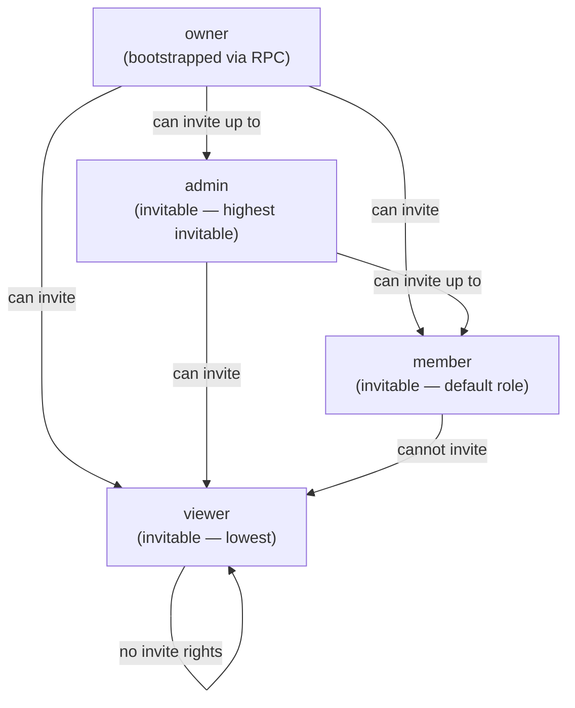

# User Personas — Bunkai TMS

> Phase 2 PRD document. Personas derived from system roles only — no invented demographics.
> Source: `lib/types.ts` (`MemberRole`), `app/api/v1/workspaces/[id]/invites/route.ts`, `app/(app)/workspaces/[id]/members/page.tsx`.
> Sibling docs: `executive-summary.md`, `user-journeys.md`.

---

## 1. Persona Discovery Summary

| Persona | System Role | Access Level | Primary Goal |
|---|---|---|---|
| Workspace Owner | `owner` | Full — all operations, cannot be invited (only bootstrapped) | Create and control the team's QA workspace; set up projects, invite the team |
| QA Lead / Admin | `admin` | Elevated — invite members, manage invites, write ATCs | Maintain team membership and ensure ATC coverage quality |
| QA Engineer | `member` | Standard — author and execute ATCs; read all workspace content | Author ATCs anchored to ACs; record test execution results |
| Stakeholder / Observer | `viewer` | Read-only | Track test coverage and quality state without mutating data |

Note: A fifth implicit user exists — the **Unauthenticated Invitee** — who lands on `/invites/accept` before having an authenticated session. This persona is transient and covered under Journey 4 (Team Invite) rather than a standing persona.

---

## 2. Persona 1 — Workspace Owner

### Identity

| Attribute | Value |
|---|---|
| System Role | `owner` |
| Evidence file | `lib/types.ts` line 13: `MemberRole = 'viewer' \| 'member' \| 'admin' \| 'owner'` |
| How Created | `bunkai_bootstrap_workspace` RPC auto-enrolls creator as `owner`. Source: `app/api/v1/workspaces/route.ts` line 67 |
| Access Level | Full — all workspace operations |
| Estimated % of Users | ~5–10% (one per workspace; most workspaces have 1 owner) |

### Goals (Inferred from Features)

| Goal | Supporting Feature | Route / Component |
|---|---|---|
| Create the team workspace | Workspace creation form | `/onboarding` → `OnboardingForm.tsx` → `POST /api/v1/workspaces` |
| Invite team members with appropriate roles | Invite issuance | `POST /api/v1/workspaces/{id}/invites` (admin/owner gated) |
| Switch between workspaces if managing multiple teams | Workspace switcher | `WorkspaceSwitcher.tsx` → `POST /api/v1/me/active-workspace` |
| Access workspace settings and member management | Members & invites page | `/workspaces/{id}/members` → `MembersPage` |
| Integrate automation pipelines via API | PAT issuance | `POST /api/v1/tokens` |

### Pain Points (Inferred from Validation / Errors)

| Pain Point | Evidence |
|---|---|
| Slug collision at workspace creation | `workspaces/route.ts` line 73: `error.code === '23505'` → "Slug is already taken" — no suggestion offered |
| Reserved slugs silently fail validation | `RESERVED_SLUGS` set in `workspaces/route.ts` lines 22–39 — error returned but no upfront list shown to user |
| Invite accept URL shown once and never retrievable | `workspaces/[id]/invites/route.ts` line 82: "warning: Copy this URL now" — MVP has no email sending |
| Cannot transfer ownership | Invite schema caps invited role at `admin`; no owner-transfer flow found |

### Feature Access

| Feature | Access | Evidence |
|---|---|---|
| Create workspace | Full | `onboarding-form.tsx` — no role check (bootstrapping flow) |
| Invite members | Full | RLS gates invite insert to `admin` or `owner`; `invites/route.ts` line 57 |
| Revoke invites | Full | `workspaces/[id]/invites/[inviteId]/route.ts` (inferred — route exists) |
| Manage member roles | Full (assumed) | RLS enforced on `workspace_members` — UI in `MembersClient` |
| Author ATCs | Full | No additional gating beyond workspace membership found |
| Issue PATs | Full | `tokens/route.ts` — session-authenticated, no role check beyond sign-in |
| Read all workspace data | Full | RLS narrows to workspace membership; owner is always a member |

### User Journey Summary

```
Register email --> /login (magic link) --> /onboarding (create workspace) --> /projects (add project) --> invite team --> /workspaces/{id}/members
```

### Profile Attributes (from Supabase Auth)

| Attribute | Source |
|---|---|
| `id` | `auth.users.id` (UUID) |
| `email` | `auth.users.email` — must match if accepting an invite |
| `created_at` | `auth.users.created_at` |
| `workspace_id` | `workspaces.owner_user_id` foreign key |

### Representative Quote *(inferred)*

> "I need to spin up a QA workspace for my team today. I want full control over who gets in, what role they have, and I want our test specs to stay on our servers — not in some SaaS vendor's cloud."

---

## 3. Persona 2 — QA Lead / Admin

### Identity

| Attribute | Value |
|---|---|
| System Role | `admin` |
| Evidence file | `workspaces/[id]/invites/route.ts` line 19: `role: z.enum(['viewer', 'member', 'admin'])` — admin is the highest invitable role |
| Access Level | Elevated — all member/write operations; cannot transfer ownership |
| Estimated % of Users | ~10–20% (typically 1–2 leads per team) |

### Goals (Inferred from Features)

| Goal | Supporting Feature | Route / Component |
|---|---|---|
| Onboard new QA engineers by email invite | Invite creation | `POST /api/v1/workspaces/{id}/invites` — role: member |
| Monitor and revoke invites that were not accepted | Invite list with derived status | `GET /api/v1/workspaces/{id}/invites` → `MembersPage` |
| Review ATC coverage across the project | Module tree + ATC table | `/projects/{projectSlug}` → `Sidebar`, `AtcTable` |
| Ensure every ATC is anchored to an AC | ATC anchoring validation | `AtcEditor.tsx` `isAnchored` gate — moat status "ENFORCED / BLOCKED" |
| Issue PATs for CI pipelines | PAT issuance | `POST /api/v1/tokens` with `run:execute` scope |

### Pain Points (Inferred from Validation / Errors)

| Pain Point | Evidence |
|---|---|
| No email notification when invite is sent | `invites/route.ts` line 79: logs to console only; inviter must manually share URL |
| Invite expires silently | `derivedStatus()` in `members/page.tsx` lines 68–73: expired status derived from `expires_at` — no proactive alert |
| Cannot assign `owner` role to a teammate via invite | Role enum in invite creation caps at `admin` |
| No bulk invite flow | Single `(email, role)` pair per API call; no CSV import found |

### Feature Access

| Feature | Access | Evidence |
|---|---|---|
| Invite members | Full | RLS gates to admin/owner; `invites/route.ts` line 57 |
| Revoke invites | Full (inferred) | `[inviteId]/route.ts` route exists |
| Author / edit ATCs | Full | No additional gate beyond `member` level found |
| Read all project data | Full | RLS membership check |
| Manage workspace settings | Limited (no owner-level actions) | Owner bootstrapping is a distinct flow |
| Issue PATs | Full (per own user) | `tokens/route.ts` — session only, user-scoped |
| Delete workspace | None (inferred) | No DELETE workspace route found |

### User Journey Summary

```
/login --> /projects --> /workspaces/{id}/members --> issue invite --> share accept URL --> monitor invite status
```

### Profile Attributes (from Supabase Auth)

Same as Owner: `id`, `email`, `created_at` from `auth.users`. Role is stored in `workspace_members.role = 'admin'`.

### Representative Quote *(inferred)*

> "I need to bring two new engineers onto the project. I'll invite them, make sure they anchor every ATC to a real AC before saving, and keep an eye on the coverage dashboard."

---

## 4. Persona 3 — QA Engineer

### Identity

| Attribute | Value |
|---|---|
| System Role | `member` |
| Evidence file | `lib/types.ts` line 13; `invites/route.ts` line 19 default: `'member'` |
| Access Level | Standard — read + write ATCs; cannot invite others |
| Estimated % of Users | ~60–75% (primary active role) |

### Goals (Inferred from Features)

| Goal | Supporting Feature | Route / Component |
|---|---|---|
| Author ATCs for a user story | ATC editor with steps + assertions | `/projects/{projectSlug}/atcs/{atcId}` → `AtcEditor.tsx` |
| Bind ATC to the correct Acceptance Criteria | Anchoring panel | `AnchoringPanel.tsx` — story search + AC multi-select |
| Categorize ATC by layer (UI/API/Unit) | Layer selector | `AtcEditor.tsx` `LAYERS` toggle — UI / API / Unit |
| Tag ATCs for filtering (smoke, regression, P1) | Tag input | `AtcEditor.tsx` tag section |
| Navigate the module tree to find related ATCs | Explorer sidebar | `Sidebar.tsx` hierarchical module/story/ATC tree |
| Use PAT to integrate with CI pipeline | PAT issuance | `POST /api/v1/tokens` scopes: `atc:read`, `run:execute` |

### Pain Points (Inferred from Validation / Errors)

| Pain Point | Evidence |
|---|---|
| Cannot save ATC without binding a user story | `actions.ts` line 25: `'Bind to a user story before saving.'` |
| Cannot save ATC without binding ≥1 AC | `actions.ts` line 29: `'Bind at least one acceptance criterion.'` |
| No title blocks save | `actions.ts` line 33: `'Title is required.'` |
| AC panel is empty if selected story has no ACs | `AnchoringPanel.tsx` lines 99–102: "This story has no Acceptance Criteria yet." — no in-app AC creation path |
| Steps and assertions require knowing Markdown + YAML | `AtcEditor.tsx` — Monaco editor for both; no guided form alternative |

### Feature Access

| Feature | Access | Evidence |
|---|---|---|
| View project / module tree | Full | RLS membership check; `projects/[projectSlug]/page.tsx` |
| Author ATCs | Full | `saveAtcAction` — no role gate beyond session |
| Read other members' ATCs | Full | `atcs.select('*').eq('project_id', ...)` — all project ATCs returned |
| Invite other members | None | RLS on `workspace_invites` gated to admin/owner |
| Manage workspace members | None | `MembersPage` accessible but mutations require admin/owner |
| Issue PATs | Full (own tokens) | `tokens/route.ts` — user-scoped |
| Delete workspace / projects | None (inferred) | No delete routes found |

### User Journey Summary

```
/login --> /projects --> /projects/{slug} (module tree) --> /projects/{slug}/atcs/{id} --> anchor to story + AC --> save
```

### Profile Attributes (from Supabase Auth)

`id`, `email`, `created_at` from `auth.users`. Role stored in `workspace_members.role = 'member'`.

### Representative Quote *(inferred)*

> "I know exactly which user story I'm testing. I just need to write the steps, pick the right Acceptance Criterion from the sidebar, and save — the system makes sure I don't miss the link."

---

## 5. Persona 4 — Stakeholder / Observer

### Identity

| Attribute | Value |
|---|---|
| System Role | `viewer` |
| Evidence file | `lib/types.ts` line 13; `invites/route.ts` line 19: `z.enum(['viewer', 'member', 'admin'])` |
| Access Level | Read-only — no write, no invite |
| Estimated % of Users | ~10–20% (PMs, developers, leadership) |

### Goals (Inferred from Features)

| Goal | Supporting Feature | Route / Component |
|---|---|---|
| See ATC coverage status for a project | ATC table with status chips | `/projects/{projectSlug}` → `AtcTable.tsx` |
| Understand which stories have ATCs and which don't | Module tree with ATC counts | `Sidebar.tsx` `countAtcs()` per module |
| Read ATC steps and assertions without editing | ATC editor page (read intent) | `/projects/{projectSlug}/atcs/{atcId}` — edit controls present but save is blocked without role gate (gap — see Discovery Gaps) |

### Pain Points (Inferred from Validation / Errors)

| Pain Point | Evidence |
|---|---|
| No dedicated read-only view — viewer lands in full editor UI | ATC editor page (`AtcEditor.tsx`) does not conditionally hide edit controls based on role |
| No aggregate coverage dashboard | No reporting or dashboard route found in app structure |
| Must know project slug to navigate | No project discovery/search UI found beyond `/projects` list |

### Feature Access

| Feature | Access | Evidence |
|---|---|---|
| View project list | Full | `/projects` page — RLS membership check |
| View module tree + ATC list | Full | `projects/[projectSlug]/page.tsx` — no role check in server component |
| Read ATC details (steps, assertions, anchoring) | Full (read-only intent) | ATC editor loads for all members; save is gated by `canSave` but no viewer-specific lock found |
| Write ATCs | None (should be blocked) | `saveAtcAction` does not currently check role — potential gap; relies on RLS on DB tables |
| Invite members | None | RLS on `workspace_invites` gated to admin/owner |
| Issue PATs | Full (own tokens) — ambiguous | `tokens/route.ts` checks session only, not role; viewer could issue a PAT |

### User Journey Summary

```
Accept invite --> /login --> /projects --> /projects/{slug} --> browse ATC table and tree (read-only)
```

### Profile Attributes (from Supabase Auth)

`id`, `email`, `created_at` from `auth.users`. Role stored in `workspace_members.role = 'viewer'`.

### Representative Quote *(inferred)*

> "I just need to see whether the login flow has passing ATCs before we cut the release. I don't want to accidentally change anything."

---

## 6. Role Hierarchy



Source: `invites/route.ts` line 57 RLS comment (admin/owner gated); `CreateBodySchema` role enum excludes `owner`.

---

## 7. Permission Matrix

| Permission | viewer | member | admin | owner |
|---|---|---|---|---|
| View project list | ✓ | ✓ | ✓ | ✓ |
| View module tree | ✓ | ✓ | ✓ | ✓ |
| View ATC details | ✓ | ✓ | ✓ | ✓ |
| Author / edit ATCs | ✗* | ✓ | ✓ | ✓ |
| Issue PATs (own) | ✓† | ✓ | ✓ | ✓ |
| Invite members | ✗ | ✗ | ✓ | ✓ |
| Revoke invites | ✗ | ✗ | ✓ | ✓ |
| View members list | ✓ | ✓ | ✓ | ✓ |
| Create workspace | ✗ | ✗ | ✗ | ✓ (bootstrap only) |
| Switch active workspace | ✓ | ✓ | ✓ | ✓ |
| Manage workspace settings | ✗ | ✗ | ✓ | ✓ |

`*` Viewer write-block relies on Supabase RLS on `atcs` table — not verified as enforced in app-layer code (gap).
`†` PAT issuance is session-gated only (not role-gated) in current code — viewer could issue a PAT.

Source: `lib/types.ts`, `actions.ts`, `invites/route.ts`, `tokens/route.ts`, `members/page.tsx`.

---

## 8. Discovery Gaps

| Gap | Impact |
|---|---|
| Viewer write-block not confirmed at app layer | ATC save action does not check `role` — relies entirely on Supabase RLS. RLS policies not readable from app code. Risk: if RLS is misconfigured, viewer can overwrite ATCs. |
| PAT issuance role gate absent | `tokens/route.ts` checks session only. A `viewer` can issue a PAT with `atc:write` scope and bypass UI-level restrictions. |
| No viewer-specific read-only ATC UI | Edit controls rendered for all roles in `AtcEditor.tsx`; only `canSave` prevents save — cancel button and all fields remain fully interactive. |
| Owner transfer mechanism | No route or form found for transferring workspace ownership. If owner leaves, workspace may be stranded. |
| Project / module / story / AC creation roles | Who can create a Project, Module, UserStory, or AcceptanceCriterion? No UI routes found — possibly API-only or not yet implemented. |

---

## 9. QA Relevance

### Test Account Requirements

Map to `.env` key naming convention `LOCAL_<ROLE>_EMAIL` / `LOCAL_<ROLE>_PASSWORD` (staging: `STAGING_<ROLE>_EMAIL`):

| `.env` Key | Persona | Role |
|---|---|---|
| `LOCAL_OWNER_EMAIL` / `LOCAL_OWNER_PASSWORD` | Workspace Owner | `owner` |
| `LOCAL_ADMIN_EMAIL` / `LOCAL_ADMIN_PASSWORD` | QA Lead / Admin | `admin` |
| `LOCAL_MEMBER_EMAIL` / `LOCAL_MEMBER_PASSWORD` | QA Engineer | `member` |
| `LOCAL_VIEWER_EMAIL` / `LOCAL_VIEWER_PASSWORD` | Stakeholder / Observer | `viewer` |
| `STAGING_OWNER_EMAIL` / `STAGING_OWNER_PASSWORD` | Workspace Owner (staging) | `owner` |
| `STAGING_ADMIN_EMAIL` / `STAGING_ADMIN_PASSWORD` | QA Lead / Admin (staging) | `admin` |
| `STAGING_MEMBER_EMAIL` / `STAGING_MEMBER_PASSWORD` | QA Engineer (staging) | `member` |
| `STAGING_VIEWER_EMAIL` / `STAGING_VIEWER_PASSWORD` | Stakeholder (staging) | `viewer` |

### Critical Persona Flows

1. **Owner bootstrapping**: `/login` → magic link → `/onboarding` → workspace create → auto-enroll as owner → `/projects`. Must complete before any other persona can exist.
2. **Admin invite + member acceptance**: Admin sends invite → URL returned in API response → Member receives URL → clicks `/invites/accept?token=...` → authenticates → accepts → joins workspace as `member`.
3. **Member ATC authoring**: `/login` → `/projects/{slug}` → sidebar → `/projects/{slug}/atcs/{id}` → anchor to story + AC → save. Moat enforcement is the critical validation.
4. **Viewer read-only access**: Same login flow → projects page → browse only. No save should succeed.

### Edge Cases

| Edge Case | Persona | Risk |
|---|---|---|
| User accepts invite with different email than invited | Invitee | 403 Forbidden — `invites/accept/route.ts` line 71 email comparison |
| Expired invite token used | Invitee | 409 Conflict — `expires_at` check |
| Revoked invite token used | Invitee | 409 Conflict — `revoked_at` check |
| Already-accepted invite used again | Invitee | 409 Conflict — `accepted_at` check |
| Viewer attempts `atc:write` via PAT | Viewer | Potential gap — PAT issuance not role-gated |
| Owner creates workspace with reserved slug | Owner | 422 Validation — reserved slug list in `workspaces/route.ts` |
| Member tries to access another workspace's project | Member | Should 404 via RLS — verify slug uniqueness assumption |
