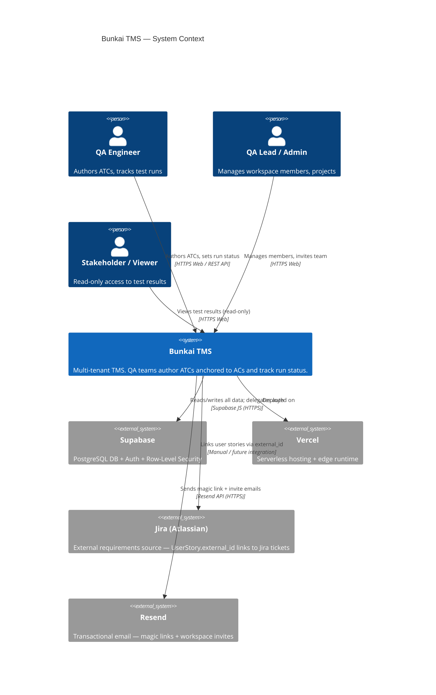
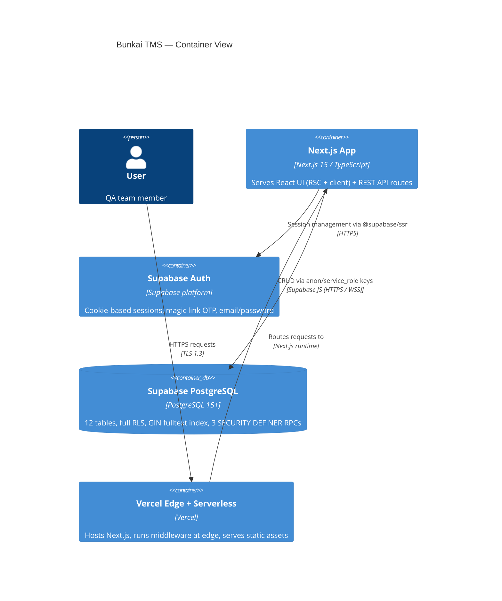
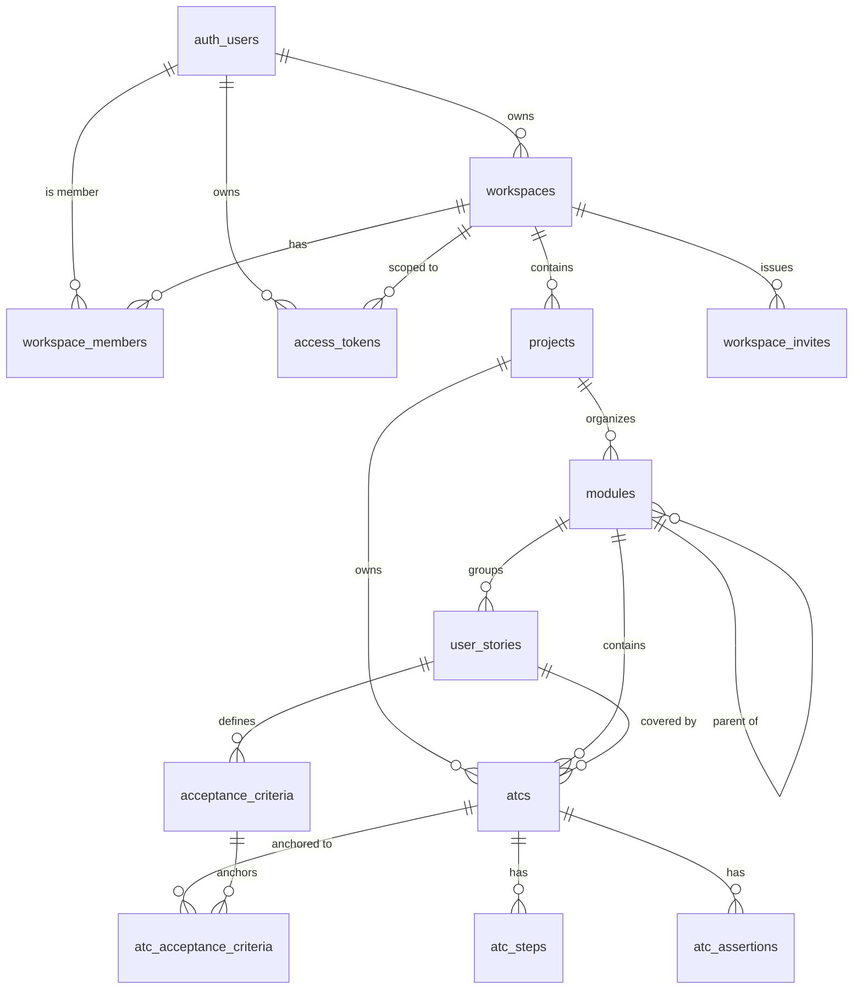
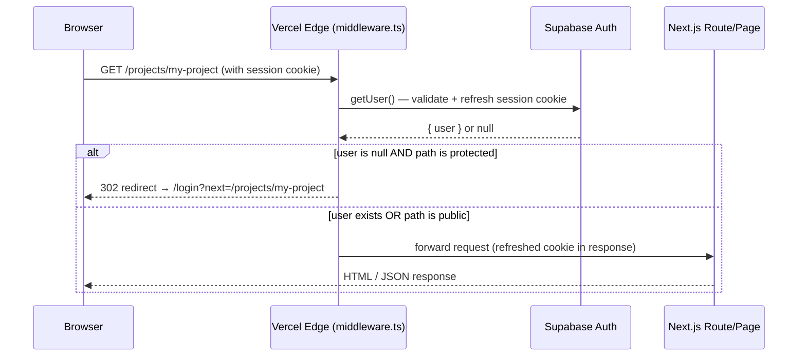
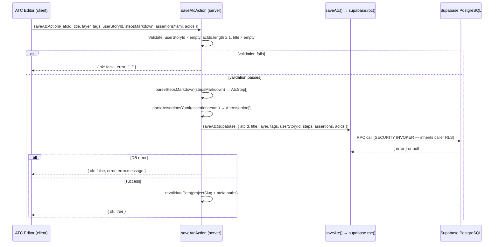

# Architecture Specs — Bunkai TMS

> Generated: 2026-06-19
> Source: `c:/Projects/UPEX/upex-bunkai-tms/` (migrations, middleware.ts, next.config.ts, lib/, app/api/)
> Confidence: High for schema + auth. Medium for deploy topology (Vercel inferred, no CI found).

---

## System Overview

**Pattern**: BFF Monolith — Next.js handles both the React frontend (RSC + client components) and the API backend (Route Handlers under `app/api/v1/`). No separate API server.

**Architecture style**: Feature-routed. Routes under `app/(app)/` are protected, `app/(auth)/` is public, `app/api/v1/` is the REST surface.

| Layer | Technology | Version | Role |
|-------|-----------|---------|------|
| Frontend | Next.js 15 App Router | ^15 | React UI, RSC rendering, page routing |
| UI library | shadcn/ui + Radix primitives | latest | Component kit |
| Styling | Tailwind CSS | ^3.4 | Utility CSS |
| State | React 19 (RSC model) | ^19 | Server-side data fetching + client interactivity |
| Backend | Next.js Route Handlers | ^15 | REST API (`/api/v1/`) + Server Actions |
| Runtime | Bun | ^1.0 | JS runtime + package manager |
| Language | TypeScript | ^5.9 strict | All source files |
| Validation | Zod | ^4 | Schema validation (client + server) |
| Database | PostgreSQL | Supabase managed | Primary datastore with RLS |
| Auth | Supabase Auth | `@supabase/ssr` ^0.10 | Sessions, magic link, email/password |
| ORM | Supabase JS client | `@supabase/supabase-js` ^2 | DB access (no ORM — direct queries + RPCs) |
| Deploy | Vercel (inferred) | — | Edge/serverless hosting |

---

## C4 Context Diagram



---

## C4 Container Diagram



---

## Component Structure

```
upex-bunkai-tms/
├── app/
│   ├── (auth)/          # Public auth routes (no auth middleware)
│   │   └── login/       # Magic link + email/password login
│   ├── (app)/           # Protected routes (middleware guards /projects, /onboarding)
│   │   ├── onboarding/  # Workspace creation flow (new user first step)
│   │   ├── projects/    # Project list + ATC tree + ATC editor
│   │   └── workspaces/  # Member management
│   ├── api/
│   │   ├── v1/          # REST API (auth, me, workspaces, tokens, invites, health)
│   │   └── openapi/     # Live OpenAPI JSON endpoint
│   ├── auth/callback/   # Supabase OAuth callback handler
│   ├── invites/accept/  # Token-based invite acceptance page
│   └── qa/             # In-app testability guide (for QA teams)
├── components/          # Shared React components (shadcn/ui based)
├── lib/
│   ├── supabase/        # Supabase client factories (server, client, middleware)
│   ├── api/             # API client helpers (fetch wrappers)
│   ├── openapi/         # OpenAPI registry (zod-to-openapi)
│   ├── atc-parse.ts     # ATC steps (Markdown) + assertions (YAML) parsers
│   ├── env.ts           # Zod-validated environment variables (server-only)
│   ├── types.ts         # TypeScript entity interfaces
│   ├── tree.ts          # Module tree data structure helpers
│   └── urls.ts          # URL builder utilities
├── supabase/
│   └── migrations/      # 12 SQL migrations (schema + RLS + triggers + RPCs)
├── middleware.ts         # Auth guard — Supabase session refresh + route protection
└── next.config.ts       # Next.js config (reactStrictMode, typedRoutes)
```

| Directory | Architectural Role | Key Files |
|-----------|-------------------|-----------|
| `app/(auth)/` | Public auth surface | `login/page.tsx`, `magic-link-form.tsx` |
| `app/(app)/` | Protected product UI | `projects/`, `workspaces/`, `onboarding/` |
| `app/api/v1/` | REST API layer | Route handlers per resource |
| `lib/supabase/` | DB access abstraction | `server.ts`, `client.ts`, `rpc.ts` |
| `lib/` | Domain utilities | `atc-parse.ts`, `types.ts`, `env.ts` |
| `supabase/migrations/` | Schema source of truth | 12 `.sql` files |
| `middleware.ts` | Edge auth guard | Session refresh + route protection |

---

## Database Schema

### ER Diagram (core FK relationships)



### Table Detail

| Table | PK | Key Columns | Key Indexes | RLS |
|-------|----|-------------|-------------|-----|
| `workspaces` | uuid | slug (UK), name, owner_user_id, plan | `owner_user_id_idx` | SELECT: active member; INSERT: self-owner; UPDATE/DELETE: owner role |
| `workspace_members` | (workspace_id, user_id) | role, status, joined_at | `user_id_idx` (RLS hot path) | SELECT: self or admin/owner; INSERT/UPDATE/DELETE: admin/owner |
| `workspace_invites` | uuid | workspace_id, email, role, token_hash (UK), expires_at, accepted_at, revoked_at | `workspace_id_idx`, `email_idx`, `expires_at_idx` | SELECT/INSERT/UPDATE/DELETE: workspace admin/owner only |
| `access_tokens` | uuid | user_id, workspace_id, name, token_prefix, hash, scopes[], expires_at, revoked_at | `token_prefix_idx`, `user_active_idx` | SELECT/INSERT/UPDATE: own tokens only; no DELETE (soft revoke) |
| `projects` | uuid | workspace_id, slug, name | — | Active member access |
| `modules` | uuid | project_id, parent_module_id (self-ref), path, name, position | — | Active member access |
| `user_stories` | uuid | module_id, title, external_id, external_url | — | Active member access |
| `acceptance_criteria` | uuid | user_story_id, title, position | — | Active member access |
| `atcs` | uuid | project_id, module_id, user_story_id, slug (UK per project), title, layer, status, tags[], tsv | `project_id_idx`, `module_id_idx`, `user_story_id_idx`, `tsv_gin_idx` | SELECT: active member; INSERT/UPDATE/DELETE: member+ role |
| `atc_steps` | uuid | atc_id, position (UK per atc), content, input_data, expected | `atc_id_idx` | Inherits via atc → project → workspace |
| `atc_assertions` | uuid | atc_id, position (UK per atc), content | `atc_id_idx` | Inherits via atc |
| `atc_acceptance_criteria` | (atc_id, acceptance_criterion_id) | — | `ac_id_idx` | Inherits via atc |

### DB Functions / RPCs

| Function | Type | Purpose |
|----------|------|---------|
| `bunkai_bootstrap_workspace(slug, name)` | SECURITY DEFINER | Atomically create workspace + owner member row (bypasses chicken-and-egg RLS) |
| `bunkai_set_updated_at()` | TRIGGER | Refreshes `atcs.updated_at` on UPDATE |
| `bunkai_atcs_refresh_tsv()` | TRIGGER | Rebuilds `atcs.tsv` fulltext vector on INSERT/UPDATE of title or tags |
| `bunkai_is_workspace_admin(workspace_id)` | Helper function | Returns bool — used in invite RLS policies |

---

## Data Flow

### 1. Web Request Auth Flow



### 2. ATC Save Flow (Server Action)



---

## External Services

| Service | Purpose | Integration Point | Credential Key |
|---------|---------|-------------------|---------------|
| Supabase Auth | Cookie session management, magic link OTP, email/password | `@supabase/ssr` `createServerClient` | `NEXT_PUBLIC_SUPABASE_URL`, `NEXT_PUBLIC_SUPABASE_ANON_KEY`, `SUPABASE_SERVICE_ROLE_KEY` |
| Supabase PostgreSQL | Primary data store, RLS, RPCs | Supabase JS client | Same as above |
| Vercel | Serverless hosting, edge middleware, static CDN | Deploy target | Vercel project (env managed via Vercel dashboard) |
| Resend | Transactional email (magic links, workspace invites) | `RESEND_API_KEY` present in `.env.example` — implementation via Supabase Auth SMTP or direct API | `RESEND_API_KEY` |
| Jira (Atlassian) | External requirements source (linked via `UserStory.external_id`) | Manual link — no API integration found in source | `ATLASSIAN_*` (QA tooling only, not used by app) |
| DBHub | QA tooling — direct DB access for test validation | `dbhub.toml` | `POSTGRES_URL`, `POSTGRES_USER`, etc. |

> API contract: `GET /api/openapi` — live OpenAPI JSON. Technical types: `bun run api:sync` → `api/openapi-types.ts`. Business angle: `/business-api-map` (post-discovery command).

---

## Security Architecture

### Authentication
- **Method**: Supabase Auth cookie-based session (`@supabase/ssr`)
- **Session storage**: httpOnly cookies (set by Supabase SSR client via `setAll` cookie handler in middleware)
- **Login methods**: Email + password (`POST /api/v1/auth/signin`) + Magic link OTP (`POST /api/v1/auth/magic-link`)
- **API auth (headless)**: Bearer PAT — `Authorization: Bearer bk_pat_<prefix>.<secret>`. Middleware: lookup by `token_prefix` (O(1) index) → constant-time SHA-256 compare against `access_tokens.hash`
- **Session refresh**: Happens on every request in middleware before any route logic (`getUser()` call)

### Authorization
- **Primary gate**: PostgreSQL Row-Level Security (RLS) on all 12 tables
- **Role hierarchy** (enforced via `workspace_members.role`): viewer < member < admin < owner
- **Pattern**: Every RLS policy subqueries `workspace_members` for the caller's role + `status = 'active'`
- **App-layer guard** (server actions): `saveAtcAction` validates title, userStoryId, acIds — but does NOT check role (relies entirely on RLS for write-block)
- **PAT scopes**: `atc:read`, `atc:write`, `run:execute`, `workspace:admin` — stored as `text[]` on `access_tokens.scopes`

### Data Protection
- **PAT secret**: SHA-256 hash only stored; plaintext returned exactly once at issuance (`bk_pat_<prefix>.<secret>` format)
- **Invite token**: Hash only stored; raw token returned once at issuance; 7-day expiry
- **Service role key**: Never exposed to browser (`lib/env.ts` — `server-only` import)
- **Magic link replay guard**: `magic_link_token_secrets` table (migration 0009 cross-cutting — confirmed by SRS subagent)
- **Soft revoke**: `access_tokens.revoked_at` — no DELETE RLS policy (audit trail preserved)

### Security Gaps (Discovery)
- **HTTP security headers**: ABSENT. `next.config.ts` has no `headers()` function. No CSP, HSTS, X-Frame-Options, X-Content-Type-Options configured. (HIGH — recommend adding via Next.js `headers()` or Vercel config)
- **Rate limiting**: ABSENT. No middleware rate limiter, no Upstash/Redis integration. All API endpoints are unthrottled. (HIGH — recommend Vercel Edge rate limiting or `@upstash/ratelimit`)
- **Input sanitization**: Zod validates structure and types; no XSS sanitization library detected (DOMPurify, sanitize-html). React escapes JSX renders by default. (MEDIUM)

---

## Performance Hooks

| Feature | Implementation | Evidence |
|---------|---------------|----------|
| ATC fulltext search | `atcs.tsv` tsvector column + GIN index; refresh trigger on title/tags change | migration 0004 |
| Next.js page caching | `revalidatePath()` called after ATC save (path-based ISR invalidation) | `actions.ts:51-52` |
| DB index on RLS hot path | `workspace_members.user_id_idx` — every RLS subquery walks this | migration 0001 |
| Token prefix lookup | `access_tokens.token_prefix_idx` — O(1) lookup before hash compare | migration 0008 |
| Rate limiting | **Not implemented** — Discovery Gap |
| Connection pooling | Supabase managed pooler (Supavisor). Pooling URL available via `POSTGRES_URL` (port 6543) | `.env.example` |

---

## Discovery Gaps

| Gap | Impact | Suggested Source |
|-----|--------|-----------------|
| No security headers (CSP, HSTS, X-Frame-Options) | HIGH — XSS, clickjacking risk | Add `headers()` to `next.config.ts` |
| No rate limiting | HIGH — brute force / abuse | Vercel Edge config or Upstash |
| ATC status update mechanism | CRITICAL — `AtcStatus` enum defined but no route/action found to change it | Check for planned `test_runs`/`test_executions` migration |
| `Run` entity | HIGH — DESIGN.md references `RUN-XXX` IDs; no `runs` table in 12 migrations | Planned future migration — confirm with team |
| CI/CD pipeline | MEDIUM | Check Vercel dashboard / GitHub |
| Staging/Production URLs | MEDIUM | Vercel project settings |
| Resend integration code | MEDIUM | Check if Supabase Auth handles email or if Resend SDK is used directly |
| `activity_log` table write path | LOW | Subagent found table referenced but not confirmed in application code |

---

## QA Relevance

### Components to Test

| Component | Test Priority | Test Type |
|-----------|--------------|-----------|
| Middleware auth guard | P0 | Integration — protected routes without session redirect to login |
| RLS policies | P0 | Integration — cross-workspace data isolation, role-based mutations |
| `bunkai_bootstrap_workspace()` RPC | P0 | Integration — workspace creation, slug validation, atomic rollback |
| `saveAtcAction` | P0 | Integration — ATC anchoring moat (empty acIds rejected), RLS write-block for viewers |
| PAT issuance + bearer auth | P1 | API — token lifecycle, scope enforcement, soft revoke |
| Invite flow | P1 | E2E — invite email, token accept, membership activation |
| ATC fulltext search | P2 | API — tsvector results for tag queries |

### Environment Requirements for Testing

| Requirement | Detail |
|-------------|--------|
| Supabase project | Dedicated test project (separate from staging) or Supabase local dev |
| Service role key | Required for test setup (seeding data bypassing RLS) |
| Multiple test users | At least 4 (owner, admin, member, viewer) per workspace |
| Magic link delivery | Email sandbox (Resend test key or Supabase local Auth) for E2E |
