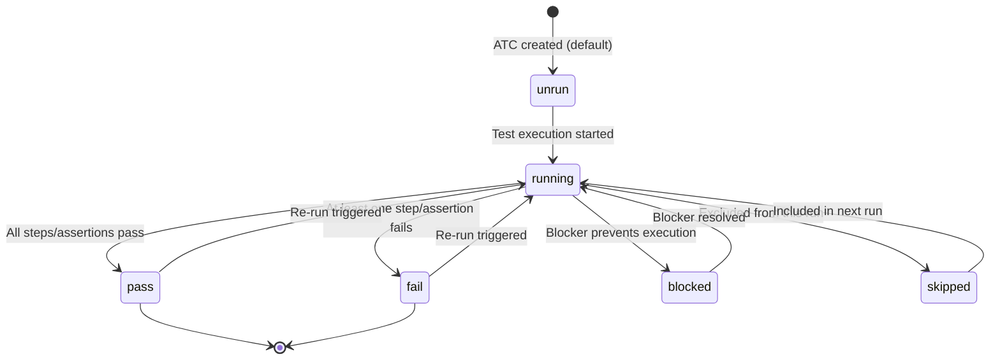
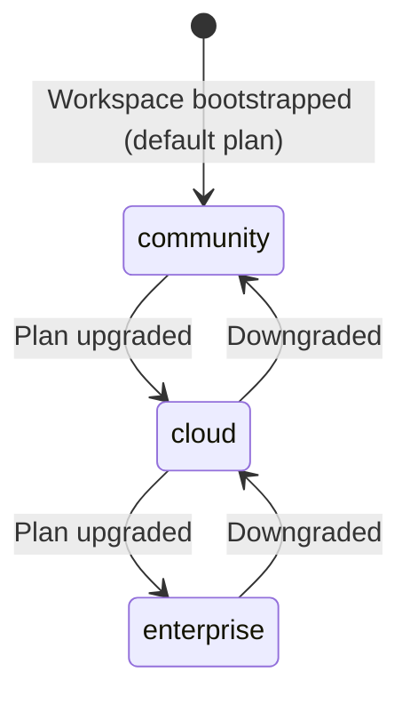
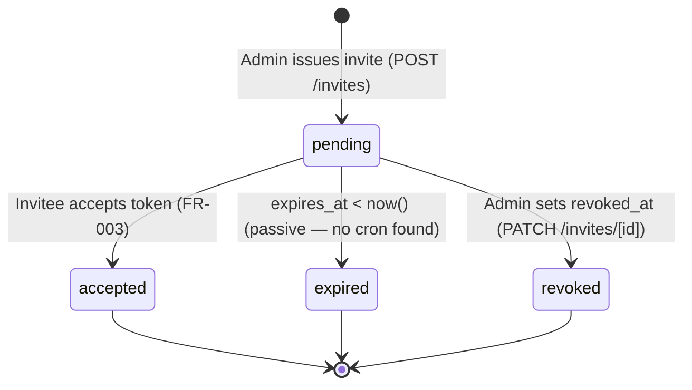

# Functional Specs — Bunkai TMS

> Generated: 2026-06-19
> Source: `supabase/migrations/` (0001–0012), `app/(app)/projects/[projectSlug]/atcs/[atcId]/actions.ts`, `supabase/migrations/0006_bootstrap_workspace.sql`, `supabase/migrations/0008_access_tokens.sql`, `supabase/migrations/0010_workspace_invites.sql`
> FR IDs are stable — downstream tests reference these IDs.

---

## Specification Index

| FR-NNN | Feature | Category | Priority |
|--------|---------|----------|---------|
| FR-001 | Workspace Bootstrap | Tenancy | P0 |
| FR-002 | Workspace Member Invite | Collaboration | P0 |
| FR-003 | Invite Accept | Collaboration | P0 |
| FR-004 | ATC Save | Core QA | P0 |
| FR-005 | PAT Create | API Access | P1 |
| FR-006 | Magic Link Auth | Auth | P0 |
| FR-007 | ATC Fulltext Search | Core QA | P1 |
| FR-008 | Active Workspace Switch | UX | P2 |

---

## FR-001: Workspace Bootstrap

| Aspect | Detail |
|--------|--------|
| Feature | Workspace Bootstrap |
| Related PRD | User Journeys — J1: Signup + Workspace Onboarding |
| Implementation | `bunkai_bootstrap_workspace(p_slug, p_name)` — SECURITY DEFINER RPC |
| Evidence | `supabase/migrations/0006_bootstrap_workspace.sql` |

**Functional Requirement**: When an authenticated user submits the onboarding form, the system atomically creates a new `workspace` row and a corresponding `workspace_members` row (role=owner, status=active) in a single transaction, returning the new workspace UUID.

**Input Specification**:
| Field | Type | Required | Constraints |
|-------|------|----------|-------------|
| p_slug | text | yes | Regex `^[a-z0-9][a-z0-9-]{1,38}[a-z0-9]$` (3–40 chars, lowercase, digits, hyphens, no leading/trailing hyphens) |
| p_name | text | yes | `trim(p_name)` length ≥ 1 |

**Validation Rules**:
```sql
-- Slug: DB-level check in RPC
if p_slug is null or p_slug !~ '^[a-z0-9][a-z0-9-]{1,38}[a-z0-9]$'
  raise exception 'invalid_slug' using errcode = '22023';
-- Name: DB-level check in RPC
if p_name is null or length(trim(p_name)) < 1
  raise exception 'invalid_name' using errcode = '22023';
-- Slug uniqueness: UNIQUE constraint on workspaces.slug → SQLSTATE 23505
```

**Processing Logic**:
1. Verify `auth.uid()` is not null (raises `42501` if unauthenticated)
2. Validate slug format (regex)
3. Validate name not blank
4. INSERT workspace with `plan = 'community'` (default)
5. INSERT workspace_member with `role = 'owner', status = 'active'`
6. Return workspace UUID

**Output**:
- Success: workspace UUID (uuid)
- Error `22023`: invalid_slug / invalid_name
- Error `23505`: slug already taken (UNIQUE constraint)
- Error `42501`: not authenticated

**Business Rules**: BR-001, BR-002, BR-003

---

## FR-002: Workspace Member Invite

| Aspect | Detail |
|--------|--------|
| Feature | Workspace Member Invite |
| Implementation | `POST /api/v1/workspaces/[id]/invites` |
| Evidence | `supabase/migrations/0010_workspace_invites.sql`; `app/api/v1/workspaces/[id]/invites/route.ts` |

**Functional Requirement**: An admin or owner of a workspace can invite a user by email address with a specified role (viewer, member, or admin). The system stores only the token hash; the raw token is returned exactly once in the API response.

**Input Specification**:
| Field | Type | Required | Constraints |
|-------|------|----------|-------------|
| email | text | yes | Valid email format |
| role | text | yes | One of: viewer, member, admin (owner role NOT invitable) |
| workspace_id | uuid | path param | Must be a workspace the caller admins |

**Validation Rules**:
```sql
-- Role constraint (DB CHECK)
check (role in ('viewer','member','admin'))
-- Note: 'owner' cannot be granted via invite
-- RLS: INSERT requires bunkai_is_workspace_admin(workspace_id)
```

**Processing Logic**:
1. Verify caller is admin/owner of target workspace (RLS / `bunkai_is_workspace_admin`)
2. Generate invite token (`bk_inv_<random>` format — inferred from secret split pattern)
3. Hash token (SHA-256 stored as `token_hash`)
4. INSERT `workspace_invites` with `expires_at = now() + interval '7 days'`, `accepted_at = null`, `revoked_at = null`
5. Return raw token in response (once only)
6. Application sends invite email via Resend (or Supabase Auth email — Discovery Gap)

**Output**:
- Success: `{ id, token, expires_at }` (token shown once only)
- Error: 403 if caller is not admin/owner
- Error: 422 if role = 'owner' or invalid email

**Business Rules**: BR-010, BR-011, BR-012

---

## FR-003: Invite Accept

| Aspect | Detail |
|--------|--------|
| Feature | Invite Accept |
| Implementation | `POST /api/v1/invites/accept` |
| Evidence | `supabase/migrations/0010_workspace_invites.sql` (columns: accepted_at, accepted_by_user_id) |

**Functional Requirement**: When the invited user submits the invite token, the system validates the token (hash match, not expired, not revoked, not already accepted) and upserts a `workspace_members` row activating the invitee's membership.

**Input Specification**:
| Field | Type | Required | Constraints |
|-------|------|----------|-------------|
| token | text | yes | Raw invite token (`bk_inv_*`) |

**Validation Rules** (enforced in route handler + DB):
- Token hash must match a `workspace_invites.token_hash` row
- `expires_at > now()` (not expired — 7-day window)
- `accepted_at IS NULL` (not already accepted)
- `revoked_at IS NULL` (not revoked)
- Invitee email must match `auth.users.email` of the caller

**Processing Logic**:
1. Hash incoming token
2. Lookup `workspace_invites` by hash
3. Validate: not expired, not accepted, not revoked
4. Validate: caller email matches invite email
5. UPSERT `workspace_members` with `status = 'active'`, `role = invite.role`
6. UPDATE `workspace_invites` set `accepted_at = now()`, `accepted_by_user_id = auth.uid()`

**Output**:
- Success: `{ workspace_id }` — redirect to workspace
- Error: 404/422 if token invalid, expired, or already used

**Business Rules**: BR-013, BR-014, BR-015

---

## FR-004: ATC Save

| Aspect | Detail |
|--------|--------|
| Feature | ATC Save (Create or Update) |
| Implementation | `saveAtcAction` (Server Action) → `saveAtc()` RPC |
| Evidence | `app/(app)/projects/[projectSlug]/atcs/[atcId]/actions.ts` |

**Functional Requirement**: An authenticated member (role ≥ member) can save an ATC by providing a title, layer, tags, a bound user story, at least one acceptance criterion link, step content (Markdown), and assertion content (YAML). The system parses the content formats and persists all ATC sub-records atomically.

**Input Specification**:
| Field | Type | Required | Constraints |
|-------|------|----------|-------------|
| atcId | string | yes | UUID of existing ATC row |
| projectSlug | string | yes | Used for cache revalidation path |
| title | string | yes | `title.trim().length > 0` |
| layer | string | yes | One of: UI, API, Unit |
| tags | string[] | no | Array of tag strings |
| userStoryId | string | yes | UUID — must not be empty |
| stepsMarkdown | string | no | Parsed by `parseStepsMarkdown()` |
| assertionsYaml | string | no | Parsed by `parseAssertionsYaml()` |
| acIds | string[] | yes | At least 1 — the "anchoring moat" |

**Validation Rules**:
```typescript
// actions.ts:26-32
if (!input.userStoryId) return { ok: false, error: 'Bind to a user story before saving.' }
if (input.acIds.length === 0) return { ok: false, error: 'Bind at least one acceptance criterion.' }
if (input.title.trim().length === 0) return { ok: false, error: 'Title is required.' }
// DB: atcs.layer CHECK (layer in ('UI','API','Unit'))
// DB: RLS write requires role in ('member','admin','owner')
```

**Processing Logic**:
1. Validate userStoryId, acIds.length ≥ 1, title not blank
2. `parseStepsMarkdown(stepsMarkdown)` → `AtcStep[]`
3. `parseAssertionsYaml(assertionsYaml)` → `AtcAssertion[]`
4. Call `saveAtc(supabase, { ... })` → delegates to Supabase RPC (SECURITY INVOKER — inherits caller's RLS)
5. On success: `revalidatePath` for both ATC editor path and project tree path
6. Return `{ ok: true }` or `{ ok: false, error }`

**Output**:
- `{ ok: true }` on success
- `{ ok: false, error: string }` on validation failure or DB error
- DB-level 403: if caller is `viewer` (RLS blocks UPDATE on `atcs`)

**Business Rules**: BR-020, BR-021, BR-022

---

## FR-005: PAT Create

| Aspect | Detail |
|--------|--------|
| Feature | Personal Access Token (PAT) Create |
| Implementation | `POST /api/v1/tokens` |
| Evidence | `supabase/migrations/0008_access_tokens.sql` |

**Functional Requirement**: An authenticated user can create a named API token scoped to a workspace (or global). The system returns the raw token exactly once in the format `bk_pat_<prefix>.<secret>`; only the SHA-256 hash and 12-char prefix are persisted.

**Input Specification**:
| Field | Type | Required | Constraints |
|-------|------|----------|-------------|
| name | text | no | Human-readable label |
| workspace_id | uuid | no | null = cross-workspace (global) |
| scopes | string[] | yes | Non-empty; subset of: `atc:read`, `atc:write`, `run:execute`, `workspace:admin` |
| expires_at | timestamptz | no | Optional expiry |

**Validation Rules**:
```sql
-- DB CHECK constraints
constraint access_tokens_scopes_nonempty check (array_length(scopes, 1) >= 1)
constraint access_tokens_scopes_allowed check (
  scopes <@ array['atc:read', 'atc:write', 'run:execute', 'workspace:admin']::text[]
)
```

**Processing Logic**:
1. Generate random secret (`bk_pat_<12-char-prefix>.<rest>`)
2. Compute SHA-256(`<secret>`) → store as `hash`
3. Store `token_prefix` = first 12 chars of secret
4. INSERT `access_tokens` (hash, token_prefix, scopes, expires_at, workspace_id)
5. Return `{ id, token: "bk_pat_<prefix>.<secret>" }` — this is the ONLY time the raw token is returned

**Output**:
- `{ id, token }` — raw token shown once
- Error 422: empty scopes or invalid scope value
- Note: No DELETE RLS — revocation via UPDATE `revoked_at`

**Business Rules**: BR-030, BR-031, BR-032

---

## FR-006: Magic Link Auth

| Aspect | Detail |
|--------|--------|
| Feature | Magic Link Authentication |
| Implementation | `POST /api/v1/auth/magic-link` → Supabase OTP |
| Evidence | `app/api/v1/auth/magic-link/route.ts`; middleware.ts (`getUser()`) |

**Functional Requirement**: A user enters their email; the system sends a one-time login link (OTP via Supabase Auth). Following the link logs the user in and redirects to the `?next=` path if present.

**Input**: `{ email: string }` (email format validated)

**Processing Logic**:
1. POST to Supabase Auth OTP API (`signInWithOtp`)
2. Supabase sends email containing one-time link
3. User follows link → browser hits `GET /auth/callback?code=...`
4. Callback route exchanges code for session cookie
5. Redirect to `next` query param or default protected route

**Business Rules**: BR-040 (magic link replay guard — `magic_link_token_secrets` table prevents reuse)

---

## FR-007: ATC Fulltext Search

| Aspect | Detail |
|--------|--------|
| Feature | ATC Fulltext Search |
| Implementation | `atcs.tsv` GIN index + `bunkai_atcs_refresh_tsv()` trigger |
| Evidence | `supabase/migrations/0004_atcs.sql` |

**Functional Requirement**: Users can search ATCs within a project by title or tag keywords; the system returns matching ATCs using PostgreSQL fulltext search (English language dictionary).

**Implementation**:
- `atcs.tsv` column: populated by trigger on INSERT and UPDATE of `title` or `tags`
- `tsvector` built from: `title || ' ' || array_to_string(tags, ' ')`
- Language: `'english'` (configurable — Discovery Gap: language hardcoded)
- Index: `atcs_tsv_gin_idx` (GIN)
- Query pattern: `atcs @@ to_tsquery('english', ...)` or `@@ plainto_tsquery(...)`

**Business Rules**: BR-050 (search scope: within workspace via RLS; no cross-workspace results)

---

## FR-008: Active Workspace Switch

| Aspect | Detail |
|--------|--------|
| Feature | Active Workspace Switch |
| Implementation | `POST /api/v1/me/active-workspace` |
| Evidence | `app/api/v1/me/active-workspace/route.ts` |

**Functional Requirement**: An authenticated user can switch their active workspace context; the system persists the selection in an httpOnly cookie (`bk_active_ws`).

**Input**: `{ workspace_id: string }` (UUID of a workspace the user is a member of)

**Processing Logic**:
1. Verify caller is a member of target workspace
2. SET httpOnly cookie `bk_active_ws = workspace_id`
3. Return 200

**Note**: HTTP method exported as POST (discovered discrepancy: OpenAPI route list showed PATCH — confirm which is canonical. Source is authoritative: POST.)

---

## State Machines

### AtcStatus



> **Gap**: No route or server action found to transition `atcs.status`. The `runs` / `test_executions` entity that drives status changes is planned but not yet implemented.

### MemberStatus

```mermaid
stateDiagram-v2
  [*] --> invited: Admin creates invite; invitee not yet member
  invited --> active: Invitee accepts token (FR-003)
  active --> suspended: Admin suspends member
  suspended --> active: Admin re-activates member
  active --> [*]: Admin removes membership (DELETE)
```



### WorkspacePlan



> **Gap**: Plan upgrade/downgrade logic not found in source. `WorkspacePlan` enum exists; PATCH `workspaces/[id]` route likely handles it but billing is not implemented.

### WorkspaceInvite Lifecycle



---

## Business Rules Summary

| BR-NNN | Rule | Entities | Source |
|--------|------|----------|--------|
| BR-001 | Workspace slug must match `^[a-z0-9][a-z0-9-]{1,38}[a-z0-9]$` | workspaces | migration 0006 RPC |
| BR-002 | Workspace name must not be blank after trim | workspaces | migration 0006 RPC |
| BR-003 | Workspace + owner member row created atomically — no partial state | workspaces, workspace_members | migration 0006 SECURITY DEFINER |
| BR-004 | Workspace slug is globally unique | workspaces | UNIQUE constraint |
| BR-005 | Only owner role can DELETE workspace | workspaces | RLS `workspaces_delete_owner` |
| BR-006 | Only owner can UPDATE workspace | workspaces | RLS `workspaces_update_owner` |
| BR-007 | Member status must be 'active' to access any workspace data | all tables | All RLS policies |
| BR-008 | INSERT/UPDATE/DELETE on workspace_members requires admin or owner | workspace_members | RLS |
| BR-009 | INSERT/UPDATE/DELETE on atcs, atc_steps, atc_assertions requires role >= member | atcs et al | RLS `*_member_plus` policies |
| BR-010 | Invite role cannot be 'owner' (only viewer, member, admin invitable) | workspace_invites | DB CHECK |
| BR-011 | Only admin or owner can issue invites | workspace_invites | RLS INSERT + `bunkai_is_workspace_admin` |
| BR-012 | Invite token hash only stored — raw token returned once at issuance | workspace_invites | migration 0010 design |
| BR-013 | Invite expires 7 days after issuance | workspace_invites | DEFAULT `now() + interval '7 days'` |
| BR-014 | Invite token is one-time — accepted_at IS NOT NULL means already used | workspace_invites | FR-003 validation |
| BR-015 | Invitee email must match the authenticated caller's email | workspace_invites | FR-003 validation |
| BR-016 | Revoked invites (`revoked_at IS NOT NULL`) cannot be accepted | workspace_invites | FR-003 validation |
| BR-020 | ATC must be bound to a user story before saving | atcs | saveAtcAction:26 |
| BR-021 | ATC must reference at least one acceptance criterion (anchoring moat) | atc_acceptance_criteria | saveAtcAction:29 |
| BR-022 | ATC title must not be blank | atcs | saveAtcAction:32 |
| BR-023 | ATC slug is unique per project | atcs | UNIQUE(project_id, slug) |
| BR-024 | ATC step position is unique per ATC | atc_steps | UNIQUE(atc_id, position) |
| BR-025 | ATC layer must be one of: UI, API, Unit | atcs | DB CHECK |
| BR-026 | ATC status must be one of: pass, fail, blocked, skipped, running, unrun | atcs | DB CHECK |
| BR-030 | PAT scopes must be non-empty | access_tokens | DB CHECK `scopes_nonempty` |
| BR-031 | PAT scopes must be a subset of allowed values | access_tokens | DB CHECK `scopes_allowed` |
| BR-032 | PAT secret hash only stored — raw token returned once | access_tokens | migration 0008 design |
| BR-033 | PAT revocation is soft (revoked_at) — no DELETE allowed | access_tokens | No DELETE RLS policy |
| BR-040 | Magic link OTP tokens are single-use (replay guard) | magic_link_token_secrets | migration 0009 (confirmed by SRS subagent) |
| BR-050 | Fulltext search results respect RLS — no cross-workspace data | atcs | RLS on `atcs` table |

---

## Validation Rules Catalog

### Workspace

| Field | Rules | Error |
|-------|-------|-------|
| slug | Regex `^[a-z0-9][a-z0-9-]{1,38}[a-z0-9]$`, unique | `invalid_slug` (22023) / `23505` duplicate |
| name | `trim(name).length >= 1` | `invalid_name` (22023) |
| plan | One of: community, cloud, enterprise | DB CHECK violation |
| owner_user_id | `auth.uid()` at creation time | RLS blocks mismatch |

### ATC

| Field | Rules | Error |
|-------|-------|-------|
| title | `title.trim().length > 0` | `'Title is required.'` |
| userStoryId | Not empty | `'Bind to a user story before saving.'` |
| acIds | `acIds.length >= 1` | `'Bind at least one acceptance criterion.'` |
| layer | One of: UI, API, Unit | DB CHECK violation |
| status | One of: pass, fail, blocked, skipped, running, unrun | DB CHECK violation |
| slug | Unique per project | DB UNIQUE constraint |

### Access Token

| Field | Rules | Error |
|-------|-------|-------|
| scopes | `array_length(scopes, 1) >= 1` | DB CHECK `scopes_nonempty` |
| scopes | `scopes <@ ['atc:read','atc:write','run:execute','workspace:admin']` | DB CHECK `scopes_allowed` |

### Workspace Invite

| Field | Rules | Error |
|-------|-------|-------|
| role | One of: viewer, member, admin | DB CHECK (owner excluded) |
| email | Valid email format | 422 |
| expires_at | `now() + interval '7 days'` (auto) | — |

---

## Discovery Gaps

| Gap | Impact | Question |
|-----|--------|---------|
| ATC status transition | CRITICAL — `AtcStatus` has 6 values but no route/action changes `atcs.status` | Is there a test run / test execution entity planned? How is status set? |
| `saveAtc()` RPC internals | HIGH — calls `lib/supabase/rpc.ts` but source not read | Does it upsert steps + assertions + AC links atomically? What are failure modes? |
| ATC creation flow | HIGH — ATC UUID is an input to `saveAtcAction` but no "create new ATC" endpoint found | How is a new `atcs` row first created? Separate endpoint or different action? |
| Project/Module/UserStory creation | HIGH — ATC save requires these to exist; no creation UI/API found | Are these created via API, admin panel, or import? |
| Magic link replay guard details | MEDIUM | What is the token lifetime? What is stored in `magic_link_token_secrets`? |
| FR-008 HTTP method | LOW — source shows POST, API spec says PATCH | Which is canonical? Source wins for now (POST). |

---

## QA Relevance

### Test Case Derivation from FRs

| FR | Test Cases (derived) | Technique |
|----|---------------------|-----------|
| FR-001 (Bootstrap) | Valid slug + name → success; blank name → error; invalid slug format (leading hyphen, too short, too long) → error; duplicate slug → 23505; unauthenticated → 42501 | BVA on slug length (2, 3, 40, 41 chars) |
| FR-002 (Invite) | Admin can invite; owner can invite; member cannot invite (403); viewer cannot invite (403); role=owner rejected; duplicate email same workspace | Decision Table (role × action) |
| FR-003 (Accept) | Valid token → membership created; expired token → rejected; already-accepted → rejected; revoked → rejected; wrong email → rejected; non-existent token → 404 | EP + State-Transition |
| FR-004 (ATC Save) | Valid full save → success; empty acIds → error; empty userStoryId → error; blank title → error; viewer calling → RLS 403; invalid layer value → DB error | EP + BVA on acIds.length |
| FR-005 (PAT) | Valid scopes → token issued; empty scopes → DB CHECK fail; invalid scope value → DB CHECK fail; soft revoke → token rejected; expired token → rejected | EP + BVA |
| FR-007 (Search) | Title keyword match; tag keyword match; no match → empty; cross-workspace search → no results (RLS) | EP |

### Boundary Values

| Entity | Field | Min | Max | Invalid |
|--------|-------|-----|-----|---------|
| Workspace slug | length | 3 chars | 40 chars | 2 chars (too short), 41 chars (too long), leading hyphen, trailing hyphen |
| ATC acIds | array length | 1 | unbounded | 0 (rejected) |
| PAT scopes | array length | 1 | 4 (all allowed) | 0 (rejected), unknown scope value |
| Invite expires_at | relative | now + 7 days (fixed) | — | past date if manually set |
