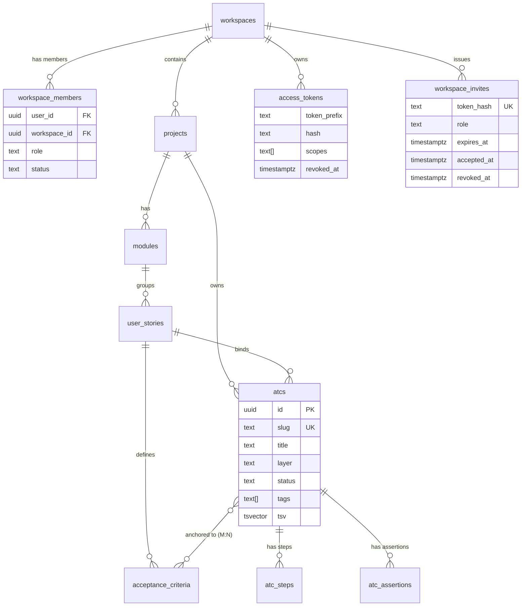

# Business Data Map — Bunkai TMS

> Generated: 2026-06-19
> Command: `/business-data-map`
> Source: `lib/types.ts`, `supabase/migrations/0001–0012`, `tailwind.config.ts`

---

## Core Entities

### Workspace

| Field | Type | Notes |
|-------|------|-------|
| id | uuid | PK |
| slug | text | UK — `^[a-z0-9][a-z0-9-]{1,38}[a-z0-9]$` |
| name | text | Display name |
| plan | WorkspacePlan | community \| cloud \| enterprise |
| created_at | timestamptz | Auto |

**QA hooks**: Workspace slug validation (BVA), plan field tests, cross-workspace RLS isolation.

---

### WorkspaceMember

| Field | Type | Notes |
|-------|------|-------|
| id | uuid | PK |
| workspace_id | uuid | FK → workspaces |
| user_id | uuid | FK → auth.users |
| role | MemberRole | viewer \| member \| admin \| owner |
| status | MemberStatus | invited \| active \| suspended |
| created_at | timestamptz | Auto |

**QA hooks**: Role-based access (viewer write → 403), status checks (suspended → blocked).

---

### Project

| Field | Type | Notes |
|-------|------|-------|
| id | uuid | PK |
| workspace_id | uuid | FK → workspaces |
| slug | text | UK per workspace |
| name | text | Display name |
| created_at | timestamptz | Auto |

**QA hooks**: Project scoping (ATCs belong to projects), cross-project isolation.

---

### Module

| Field | Type | Notes |
|-------|------|-------|
| id | uuid | PK |
| project_id | uuid | FK → projects |
| name | text | Display name |
| slug | text | UK per project |
| created_at | timestamptz | Auto |

**QA hooks**: Module grouping of user stories.

---

### UserStory

| Field | Type | Notes |
|-------|------|-------|
| id | uuid | PK |
| module_id | uuid | FK → modules |
| title | text | |
| description | text | |
| external_id | text | Jira issue key (BK-XXX) |
| external_url | text | Link to Jira |
| created_at | timestamptz | Auto |

**QA hooks**: ATC–UserStory binding (FR-004 BR-020), Jira traceability via external_id.

---

### AcceptanceCriterion

| Field | Type | Notes |
|-------|------|-------|
| id | uuid | PK |
| user_story_id | uuid | FK → user_stories |
| text | text | AC description |
| order_index | integer | Display order |
| created_at | timestamptz | Auto |

**QA hooks**: "Anchoring moat" — ATC must reference ≥1 AC (BR-021). EP: empty AC list → saveAtcAction rejected.

---

### Atc (Acceptance Test Case)

| Field | Type | Notes |
|-------|------|-------|
| id | uuid | PK |
| project_id | uuid | FK → projects |
| user_story_id | uuid | FK → user_stories |
| slug | text | UK per project |
| title | text | Required, non-blank |
| layer | AtcLayer | UI \| API \| Unit |
| status | AtcStatus | unrun \| running \| pass \| fail \| blocked \| skipped |
| tags | text[] | Fulltext-indexed via tsv |
| tsv | tsvector | GIN-indexed, auto-refreshed |
| created_at / updated_at | timestamptz | Auto |

**QA hooks**: Title (BR-022), layer (BR-025), status (BR-026), slug uniqueness (BR-023), fulltext search (FR-007), status transition gap (CRITICAL).

---

### AtcStep

| Field | Type | Notes |
|-------|------|-------|
| id | uuid | PK |
| atc_id | uuid | FK → atcs |
| position | integer | UK per ATC |
| content | text | Markdown — authored in Monaco editor |
| input_data | text | Test data for this step |
| expected | text | Expected output for this step |

**QA hooks**: Step position uniqueness (BR-024), Markdown rendering, Monaco editor save behavior.

---

### AtcAssertion

| Field | Type | Notes |
|-------|------|-------|
| id | uuid | PK |
| atc_id | uuid | FK → atcs |
| content | text | YAML — assertions for this ATC |

**QA hooks**: YAML parse failures, assertion content persistence.

---

### AtcAcceptanceCriterion (M:N join)

| Field | Type | Notes |
|-------|------|-------|
| atc_id | uuid | FK → atcs |
| acceptance_criterion_id | uuid | FK → acceptance_criteria |
| PK | (atc_id, acceptance_criterion_id) | Composite |

**QA hooks**: The "anchoring moat" — every ATC must have ≥1 row here. DELETE all rows → saveAtcAction rejects on next save.

---

### AccessToken (PAT)

| Field | Type | Notes |
|-------|------|-------|
| id | uuid | PK |
| user_id | uuid | FK → auth.users |
| workspace_id | uuid | FK → workspaces (nullable = global) |
| name | text | Human label |
| token_prefix | text(12) | O(1) lookup prefix |
| hash | text | SHA-256 of full secret |
| scopes | text[] | CHECK: non-empty, allowed values only |
| expires_at | timestamptz | Nullable |
| revoked_at | timestamptz | Soft revoke |
| created_at | timestamptz | Auto |

**QA hooks**: Scopes CHECK (BR-030/031), soft revoke (BR-033), token shown once (BR-032), expired token → 401.

---

### WorkspaceInvite

| Field | Type | Notes |
|-------|------|-------|
| id | uuid | PK |
| workspace_id | uuid | FK → workspaces |
| invited_by | uuid | FK → auth.users |
| email | text | Invitee email |
| role | MemberRole | viewer \| member \| admin (no owner) |
| token_hash | text | UK — SHA-256 of raw token |
| expires_at | timestamptz | DEFAULT now() + 7 days |
| accepted_at | timestamptz | Set on accept; null = pending |
| accepted_by_user_id | uuid | FK → auth.users (set on accept) |
| revoked_at | timestamptz | Set on revoke |
| created_at | timestamptz | Auto |

**QA hooks**: Token one-time use (BR-014), expiry (BR-013), revocation (BR-016), role exclusion (BR-010), email match (BR-015).

---

## Enum Registry

| Enum | Values | Source |
|------|--------|--------|
| `WorkspacePlan` | `community` \| `cloud` \| `enterprise` | `lib/types.ts` |
| `MemberRole` | `viewer` \| `member` \| `admin` \| `owner` | `lib/types.ts` |
| `MemberStatus` | `invited` \| `active` \| `suspended` | `lib/types.ts` |
| `AtcLayer` | `UI` \| `API` \| `Unit` | `lib/types.ts` |
| `AtcStatus` | `unrun` \| `running` \| `pass` \| `fail` \| `blocked` \| `skipped` | `lib/types.ts` |
| PAT scopes | `atc:read` \| `atc:write` \| `run:execute` \| `workspace:admin` | `migrations/0008` |

---

## Entity Relationship Diagram



---

## State Flows

### AtcStatus

```
unrun (default)
  → running   (test execution started — mechanism MISSING: no `runs` entity)
  → pass      (all assertions pass)
  → fail      (at least one assertion fails)
  → blocked   (blocker prevents execution)
  → skipped   (excluded from this run)
  pass / fail / blocked / skipped → running (re-run)
```

> **CRITICAL GAP**: No route or server action found to transition `atcs.status`. The `runs` / test execution entity that drives it is not yet implemented.

### MemberStatus

```
invited → active (invite accepted — FR-003)
active → suspended (admin action)
suspended → active (admin reactivates)
```

### WorkspaceInvite Lifecycle

```
pending → accepted  (token used, email match, within expiry — FR-003)
pending → expired   (passive: expires_at < now())
pending → revoked   (admin action: PATCH revoked_at)
```

### WorkspacePlan

```
community → cloud → enterprise
enterprise → cloud → community (downgrades — billing logic not yet implemented)
```

---

## Data Flows

### ATC Save Flow

```
User → ATC Editor (Monaco) → saveAtcAction() (Server Action)
  ├── Validate: userStoryId, acIds.length ≥ 1, title not blank
  ├── parseStepsMarkdown() → AtcStep[]
  ├── parseAssertionsYaml() → AtcAssertion[]
  ├── saveAtc(supabase, {...}) → bunkai_save_atc RPC (SECURITY INVOKER)
  │     └── PostgreSQL: upsert atcs + atc_steps + atc_assertions + atc_acceptance_criteria
  └── revalidatePath() → ISR cache bust for ATC editor + project tree
```

### Auth + Session Flow

```
User → /login → email submit → Supabase OTP → email (Resend)
  → user clicks link → /auth/callback → code exchange → session cookie set
  → middleware.ts checks session on every request
  → /login?next=<path> on unauthenticated access to protected route
```

### PAT API Auth Flow

```
Client → Authorization: Bearer bk_pat_<prefix>.<secret>
  → Route Handler: extract token_prefix (12 chars)
  → SELECT access_tokens WHERE token_prefix = <prefix>
  → verify: SHA-256(secret) == stored hash
  → verify: revoked_at IS NULL, expires_at > now()
  → verify: request scope in token.scopes
  → authorize
```

### Workspace Bootstrap Flow

```
New user → /onboarding → submit {slug, name}
  → call bunkai_bootstrap_workspace(slug, name) SECURITY DEFINER RPC
  → INSERT workspaces + INSERT workspace_members (role=owner, status=active)
  → return workspace UUID → redirect to /projects/...
```

---

## Automatic Processes (Triggers)

| Trigger | Table | Event | Effect |
|---------|-------|-------|--------|
| `bunkai_atcs_refresh_tsv` | atcs | INSERT or UPDATE (title, tags) | Rebuilds `tsv` tsvector for fulltext search |
| `bunkai_bootstrap_workspace` | workspaces | RPC call | Atomic workspace + owner member creation (SECURITY DEFINER) |
| Invite expiry | workspace_invites | Passive — no cron found | `expires_at < now()` checked on accept |

> **Gap**: No cron job or background worker found for active expiry cleanup of workspace_invites or access_tokens.

---

## External Integrations

| System | Role | Auth |
|--------|------|------|
| Supabase Auth | Magic link OTP, session management | NEXT_PUBLIC_SUPABASE_ANON_KEY + service role |
| Supabase PostgreSQL | All persistent data (RLS enforced) | Supabase connection string |
| Resend | Transactional email (magic links, invites) | RESEND_API_KEY |
| Jira (BK project) | Requirements source (UserStory.external_id) | ATLASSIAN_TOKEN |
| Vercel | Hosting + edge deployment | Platform |

---

## Business Rules (Summary)

Full rules with sources → `.context/SRS/functional-specs.md` §Business Rules Summary.

| Category | Count | Key rules |
|----------|-------|-----------|
| Workspace | BR-001–006 | Slug regex, unique, atomic creation, owner-only delete |
| Membership | BR-007–009 | Active status required, admin-only member management |
| Invite | BR-010–016 | No owner role, hash-only storage, 7-day expiry, one-time use |
| ATC | BR-020–026 | userStoryId required, ≥1 AC, title not blank, layer enum, status enum |
| PAT | BR-030–033 | Non-empty scopes, allowed values, hash-only, soft revoke |
| Auth | BR-040 | OTP single-use replay guard |
| Search | BR-050 | RLS scopes fulltext results to workspace |

---

## QA Data Requirements

| Scenario | Test Account | Seed Data |
|----------|-------------|-----------|
| ATC save (member) | member role | Project + module + user story + ≥1 AC |
| ATC save (viewer → 403) | viewer role | Same project |
| Workspace invite | admin account | Active workspace |
| PAT auth | any account | Created PAT with scopes |
| ATC fulltext search | member role | ≥5 ATCs with varied titles + tags |
| Invite accept | new user (email match) | Pending invite for that email |
| Cross-workspace isolation | 2 accounts in 2 workspaces | Separate workspaces with ATCs |
| Workspace bootstrap | unauthenticated signup flow | None (RPC is atomic) |

---

## Discovery Gaps

| Gap | Severity | Impact |
|-----|----------|--------|
| `runs` entity missing — AtcStatus transition | CRITICAL | Cannot test status changes; ATC execution testing blocked |
| Project / Module / UserStory creation flow not found | HIGH | Seed data setup unclear |
| ATC creation endpoint not found | HIGH | How is a new `atcs` row first inserted before `saveAtcAction`? |
| `bunkai_save_atc` RPC source (0007) not read | HIGH | Atomicity of sub-records unconfirmed |
| No cron for invite / PAT expiry | LOW | Expired tokens persist until checked on use |
