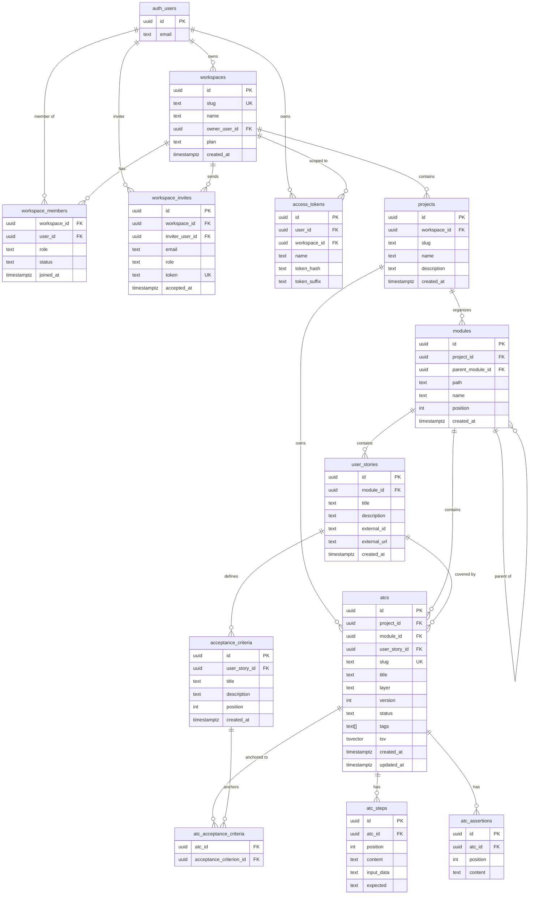
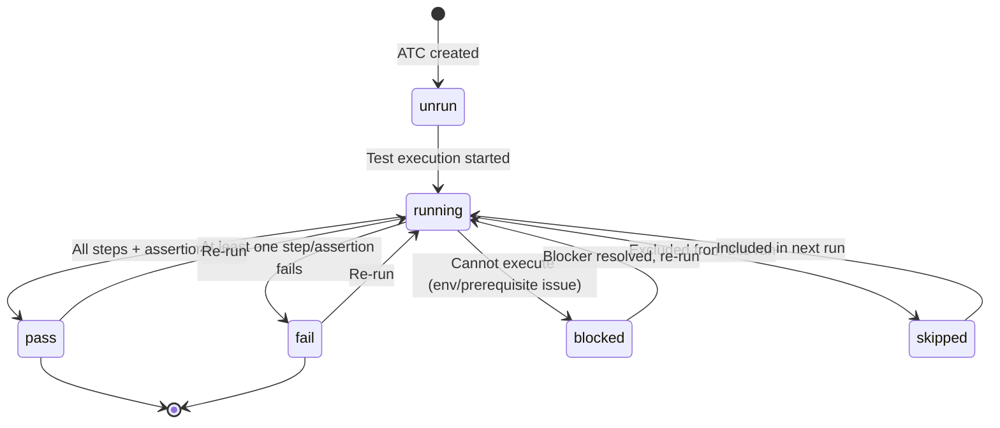
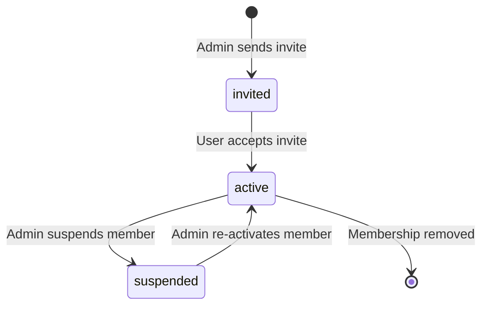
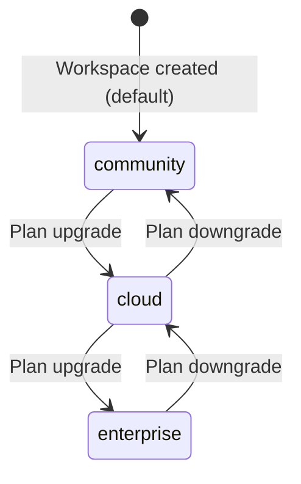
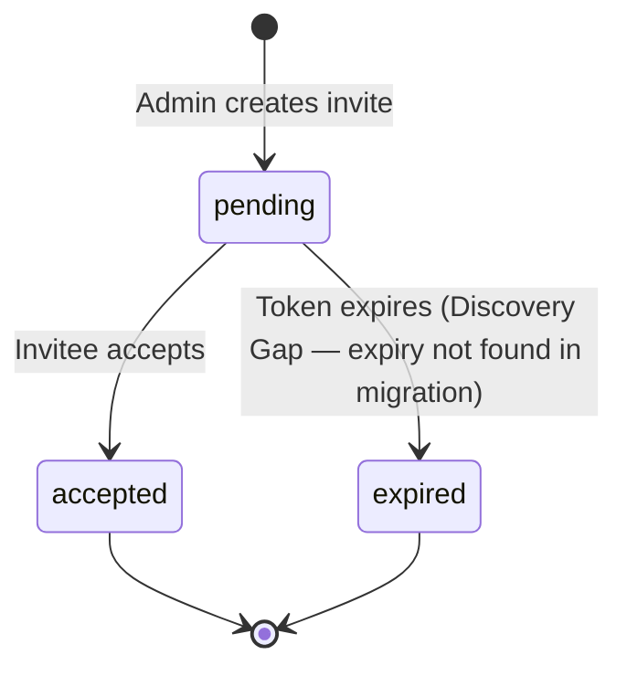

# Domain Glossary — Bunkai (分解)

> Generated: 2026-06-19
> Source: `supabase/migrations/`, `lib/types.ts`, `DESIGN.md`
> Confidence: High for all entities (derived from authoritative schema files)

---

## QA Usage Guide

Use this file as the **canonical vocabulary** for:
- Naming test cases: `TC_WorkspaceMember_Invite_Admin_CanInvite`
- Naming KATA components: `WorkspacePage`, `AtcApi`, `WorkspaceMemberSteps`
- Test data generation: use enum values exactly as listed (case-sensitive: `'pass'`, `'UI'`, `'owner'`)
- Bug reports: reference technical + business name (`ATC` / `Acceptance Test Case`)
- AT Plans: reference `AtcStatus` values for run reporting

---

## 1. Core Entities

### Workspace

| Technical Name | Business Name | Description | Table | Key Attributes | Found In |
|----------------|---------------|-------------|-------|----------------|----------|
| `workspace` | Workspace / Tenant | Multi-tenant root. Every downstream entity belongs to a workspace via `workspace_id`. | `public.workspaces` | id, slug, name, owner_user_id, plan | migrations/0001, lib/types.ts:16 |

**Relationships**:
- Has many `workspace_members` (RBAC join)
- Has many `projects`

**JSON example**:
```json
{ "id": "uuid", "slug": "upex-qa", "name": "UPEX QA", "owner_user_id": "uuid", "plan": "cloud", "created_at": "2026-01-15T10:00:00Z" }
```

---

### WorkspaceMember

| Technical Name | Business Name | Description | Table | Key Attributes | Found In |
|----------------|---------------|-------------|-------|----------------|----------|
| `workspace_member` | Workspace Member | RBAC join between a user and a workspace. Defines role + status. | `public.workspace_members` | workspace_id, user_id, role, status, joined_at | migrations/0001, lib/types.ts:24 |

**Relationships**:
- Belongs to `workspace`
- Belongs to `auth.users` (Supabase)

**JSON example**:
```json
{ "workspace_id": "uuid", "user_id": "uuid", "role": "member", "status": "active", "joined_at": "2026-01-15T10:05:00Z" }
```

---

### Project

| Technical Name | Business Name | Description | Table | Key Attributes | Found In |
|----------------|---------------|-------------|-------|----------------|----------|
| `project` | Project | Organizational unit inside a workspace. Groups modules and ATCs. | `public.projects` | id, workspace_id, slug, name, description | migrations/0002, lib/types.ts:32 |

**Relationships**:
- Belongs to `workspace`
- Has many `modules`
- Has many `atcs`

**JSON example**:
```json
{ "id": "uuid", "workspace_id": "uuid", "slug": "bunkai-web", "name": "Bunkai Web", "description": "Frontend test suite", "created_at": "2026-01-20T09:00:00Z" }
```

---

### Module

| Technical Name | Business Name | Description | Table | Key Attributes | Found In |
|----------------|---------------|-------------|-------|----------------|----------|
| `module` | Module | Hierarchical folder for organizing user stories and ATCs. Supports nesting via `parent_module_id`. | `public.modules` | id, project_id, parent_module_id, path, name, position | migrations/0002, lib/types.ts:40 |

**Relationships**:
- Belongs to `project`
- Has optional parent `module` (self-referential)
- Has many `user_stories`
- Has many `atcs`

**JSON example**:
```json
{ "id": "uuid", "project_id": "uuid", "parent_module_id": null, "path": "auth", "name": "Authentication", "position": 1, "created_at": "2026-01-20T09:00:00Z" }
```

---

### UserStory

| Technical Name | Business Name | Description | Table | Key Attributes | Found In |
|----------------|---------------|-------------|-------|----------------|----------|
| `user_story` | User Story | A product requirement unit. Can link to an external tracker (Jira) via `external_id` + `external_url`. | `public.user_stories` | id, module_id, title, description, external_id, external_url | migrations/0003, lib/types.ts:52 |

**Relationships**:
- Belongs to `module`
- Has many `acceptance_criteria`
- Has many `atcs`

**JSON example**:
```json
{ "id": "uuid", "module_id": "uuid", "title": "User can log in via magic link", "description": null, "external_id": "BK-42", "external_url": "https://upexgalaxy69.atlassian.net/browse/BK-42", "created_at": "2026-01-21T08:00:00Z" }
```

---

### AcceptanceCriterion

| Technical Name | Business Name | Description | Table | Key Attributes | Found In |
|----------------|---------------|-------------|-------|----------------|----------|
| `acceptance_criterion` | Acceptance Criterion (AC) | A single verifiable condition that a user story must satisfy. Position-ordered within a story. | `public.acceptance_criteria` | id, user_story_id, title, description, position | migrations/0003, lib/types.ts:60 |

**Relationships**:
- Belongs to `user_story`
- Linked to many `atcs` via `atc_acceptance_criteria`

**JSON example**:
```json
{ "id": "uuid", "user_story_id": "uuid", "title": "Given valid email, magic link is sent within 30s", "description": null, "position": 1, "created_at": "2026-01-21T08:01:00Z" }
```

---

### Atc

| Technical Name | Business Name | Description | Table | Key Attributes | Found In |
|----------------|---------------|-------------|-------|----------------|----------|
| `atc` | Acceptance Test Case (ATC) | A structured, executable test case anchored to ≥1 acceptance criterion. Core entity of Bunkai. | `public.atcs` | id, project_id, module_id, user_story_id, slug, title, layer, version, status, tags | migrations/0004, lib/types.ts:74 |

**Relationships**:
- Belongs to `project`, `module`, `user_story`
- Has many `atc_steps`
- Has many `atc_assertions`
- Linked to ≥1 `acceptance_criteria` via `atc_acceptance_criteria`

**JSON example**:
```json
{ "id": "uuid", "project_id": "uuid", "module_id": "uuid", "user_story_id": "uuid", "slug": "login-magic-link-happy-path", "title": "Login via magic link — happy path", "layer": "UI", "version": 1, "status": "pass", "tags": ["smoke", "auth"], "created_at": "2026-01-22T10:00:00Z", "updated_at": "2026-06-01T14:30:00Z" }
```

---

### AtcStep

| Technical Name | Business Name | Description | Table | Key Attributes | Found In |
|----------------|---------------|-------------|-------|----------------|----------|
| `atc_step` | Test Step | An ordered action within an ATC: what to do, optional input data, optional expected output. | `public.atc_steps` | id, atc_id, position, content, input_data, expected | migrations/0004, lib/types.ts:89 |

**Relationships**:
- Belongs to `atc`

---

### AtcAssertion

| Technical Name | Business Name | Description | Table | Key Attributes | Found In |
|----------------|---------------|-------------|-------|----------------|----------|
| `atc_assertion` | Test Assertion | A verifiable claim about system state after executing an ATC. Ordered within an ATC. | `public.atc_assertions` | id, atc_id, position, content | migrations/0004, lib/types.ts:98 |

**Relationships**:
- Belongs to `atc`

---

### AccessToken

| Technical Name | Business Name | Description | Table | Key Attributes | Found In |
|----------------|---------------|-------------|-------|----------------|----------|
| `access_token` | Personal Access Token (PAT) | API credential for headless/automation access. Secret split: hash + suffix stored, plain text only shown once. | `public.access_tokens` | id, user_id, workspace_id, name, token_hash, token_suffix | migrations/0008, 0011, 0012 |

**Relationships**:
- Belongs to `auth.users` + `workspace`

---

### WorkspaceInvite

| Technical Name | Business Name | Description | Table | Key Attributes | Found In |
|----------------|---------------|-------------|-------|----------------|----------|
| `workspace_invite` | Workspace Invite | Pending invitation to join a workspace. Has an accept URL flow. | `public.workspace_invites` | id, workspace_id, inviter_user_id, email, role, token, accepted_at | migrations/0010 |

**Relationships**:
- Belongs to `workspace`

---

## 2. Enumerations and Constants

### WorkspacePlan

| Value | Business Meaning | Usage Context | Found In |
|-------|-----------------|---------------|----------|
| `'community'` | Free tier | Default on workspace creation | `workspaces.plan` DEFAULT; `lib/types.ts:12` |
| `'cloud'` | Paid SaaS plan | Workspace upgrade | `workspaces.plan` CHECK; `lib/types.ts:12` |
| `'enterprise'` | Enterprise plan (self-hosted or managed) | Large teams | `workspaces.plan` CHECK; `lib/types.ts:12` |

### MemberRole

| Value | Business Meaning | Usage Context | Found In |
|-------|-----------------|---------------|----------|
| `'viewer'` | Read-only. Can see ATCs and results but cannot create/edit. | External stakeholders, PMs | RLS: SELECT only; `lib/types.ts:13` |
| `'member'` | Standard QA contributor. Can create/edit/delete ATCs, steps, assertions. | QA engineers | RLS: INSERT/UPDATE/DELETE on ATC tables; `lib/types.ts:13` |
| `'admin'` | Can manage workspace members (invite, update roles). Cannot delete the workspace. | QA leads | RLS: admin policy on workspace_members; `lib/types.ts:13` |
| `'owner'` | Full control: can delete workspace, change plan, manage all members. | Workspace creator / team lead | RLS: owner policy on workspaces; `lib/types.ts:13` |

### MemberStatus

| Value | Business Meaning | Usage Context | Found In |
|-------|-----------------|---------------|----------|
| `'active'` | Member can access the workspace. | Normal state | All RLS policies check `status = 'active'`; `lib/types.ts:14` |
| `'invited'` | Invite sent but not yet accepted. | Post-invite, pre-accept | `workspace_invites` flow; `lib/types.ts:14` |
| `'suspended'` | Access revoked but record preserved. | Admin action | `lib/types.ts:14` |

### AtcLayer

| Value | Business Meaning | Usage Context | Found In |
|-------|-----------------|---------------|----------|
| `'UI'` | End-to-end browser test. | Playwright/E2E scenarios | `atcs.layer` CHECK; DESIGN.md §3.6; `lib/types.ts:71` |
| `'API'` | REST API / integration test. | HTTP-level test cases | `atcs.layer` CHECK; `lib/types.ts:71` |
| `'Unit'` | Isolated unit test. | Function/component tests | `atcs.layer` CHECK; `lib/types.ts:71` |

### AtcStatus

| Value | Business Meaning | Usage Context | Found In |
|-------|-----------------|---------------|----------|
| `'unrun'` | Not yet executed. Default on creation. | New ATCs | `atcs.status` DEFAULT; `lib/types.ts:72` |
| `'running'` | Execution in progress. | Live test run | `atcs.status` CHECK; DESIGN.md §3.5 |
| `'pass'` | ATC passed all steps + assertions. | Successful execution | `atcs.status` CHECK |
| `'fail'` | ATC failed at least one step or assertion. | Failed execution | `atcs.status` CHECK |
| `'blocked'` | Cannot execute — external blocker (env down, prerequisite missing). | Blocked execution | `atcs.status` CHECK |
| `'skipped'` | Intentionally not run (out of scope for this run). | Selective execution | `atcs.status` CHECK |

---

## 3. Business Rules

### BR-001: ATC must be anchored to ≥1 AC

- **Description**: Every ATC must link to at least one AcceptanceCriterion before it can be considered complete.
- **Entities Affected**: `atc`, `acceptance_criterion`, `atc_acceptance_criteria`
- **Validation**: Application layer (migration 0004 comment: "anchoring moat — enforced at the application layer in MVP")
- **Error Message**: Discovery Gap — not found in source
- **Found In**: `supabase/migrations/0004_atcs.sql` comment; `lib/atc-parse.ts` (likely)

**Given/When/Then**:
```
Given an ATC has no linked acceptance criteria
When a user attempts to save/publish the ATC
Then the system rejects the operation with a validation error
```

### BR-002: RLS — active membership required for all data access

- **Description**: No table data is readable or writable unless the caller has an active membership row (`status = 'active'`) in the workspace that owns the data.
- **Entities Affected**: All tables
- **Validation**: PostgreSQL RLS policies on every table
- **Found In**: All migration files, e.g. `0001_tenancy.sql` RLS policies

**Given/When/Then**:
```
Given a user with status = 'suspended' in workspace W
When the user calls GET /api/v1/workspaces/{W}/...
Then the response is empty (RLS filters all rows) or 403
```

### BR-003: Mutations require role >= member

- **Description**: `viewer`-role members can only SELECT. INSERT/UPDATE/DELETE on ATC-related tables requires `role in ('member','admin','owner')`.
- **Entities Affected**: `atcs`, `atc_steps`, `atc_assertions`, `atc_acceptance_criteria`
- **Found In**: migration 0004 policies `*_member_plus`

**Given/When/Then**:
```
Given a user with role = 'viewer'
When they POST to create an ATC
Then the server returns 403 (RLS check fails)
```

### BR-004: Workspace delete restricted to owner

- **Description**: Only the `owner`-role active member can delete a workspace.
- **Entities Affected**: `workspaces`
- **Found In**: migration 0001 `workspaces_delete_owner` policy

### BR-005: PAT secret shown once

- **Description**: Personal Access Token plaintext is returned only at creation time. Only `token_hash` + `token_suffix` are stored. Cannot be recovered.
- **Entities Affected**: `access_tokens`
- **Found In**: migrations 0008, 0011, 0012 (token secret splitting)

---

## 4. Entity Relationship Diagram



---

## 5. Terminology Mapping

### Technical → Business

| Technical | Business / UI Label | Notes |
|-----------|---------------------|-------|
| `workspace` | Workspace / Tenant | Root isolation boundary |
| `workspace_member` | Member | User's seat in a workspace |
| `project` | Project | Test project grouping |
| `module` | Module | Folder/section of tests |
| `user_story` | User Story | Requirement being tested |
| `acceptance_criterion` | Acceptance Criterion (AC) | Verifiable condition |
| `atc` | Acceptance Test Case (ATC) | The test case itself |
| `atc_step` | Test Step | One action in an ATC |
| `atc_assertion` | Test Assertion | What to verify |
| `atc_acceptance_criteria` | ATC↔AC link | The "anchoring moat" |
| `access_token` | Personal Access Token (PAT) | API key |
| `workspace_invite` | Invite | Email invitation to join |

### Abbreviations

| Abbreviation | Expansion |
|-------------|-----------|
| ATC | Acceptance Test Case |
| AC | Acceptance Criterion |
| PAT | Personal Access Token |
| RLS | Row-Level Security (Supabase/PostgreSQL) |
| TMS | Test Management System |
| RBAC | Role-Based Access Control |
| BFF | Backend-for-Frontend (Next.js API routes pattern) |
| BK | Bunkai (Jira project key) |

---

## 6. Status / State Flows

### AtcStatus



### MemberStatus



### WorkspacePlan



### WorkspaceInvite



---

## 7. UI Labels Reference

### Form Fields (from route analysis + DESIGN.md)

| Field Label | Technical Name | Type | Found In |
|-------------|----------------|------|----------|
| Workspace Name | `workspaces.name` | text | app/(app)/onboarding/ |
| Workspace Slug | `workspaces.slug` | text | app/(app)/onboarding/ |
| Project Name | `projects.name` | text | app/(app)/projects/ |
| ATC Title | `atcs.title` | text | app/(app)/projects/[projectSlug]/atcs/[atcId]/ |
| ATC Layer | `atcs.layer` | enum chip | DESIGN.md §6 Layer chip |
| ATC Tags | `atcs.tags` | text[] | app/(app)/projects/[projectSlug]/atcs/[atcId]/ |
| Email | `auth.users.email` | email | app/(auth)/login/ |
| Step Content | `atc_steps.content` | text | DESIGN.md §2 |
| Step Input Data | `atc_steps.input_data` | text | lib/types.ts |
| Expected Result | `atc_steps.expected` | text | lib/types.ts |

### Action Buttons / Status Chips (from DESIGN.md)

| UI Label | Technical Meaning |
|----------|------------------|
| Pass | `status = 'pass'` |
| Fail | `status = 'fail'` |
| Blocked | `status = 'blocked'` |
| Skipped | `status = 'skipped'` |
| Running | `status = 'running'` |
| Unrun | `status = 'unrun'` |
| UI (layer chip) | `layer = 'UI'` |
| API (layer chip) | `layer = 'API'` |
| Unit (layer chip) | `layer = 'Unit'` |

---

## 8. Discovery Gaps

- [ ] **WorkspaceInvite expiry**: Token expiry mechanism not found in migration 0010 — needs confirmation.
- [ ] **ATC versioning**: `atcs.version` column exists (int, default 1) but version-increment trigger not found in migrations. Is it incremented on every save? Needs code confirmation.
- [ ] **Run entity**: DESIGN.md references `RUN-XXX` IDs and a "Run" screen but no `runs` table found in migrations 0001–0012. Likely planned for a future migration.
- [ ] **UI labels i18n**: No i18n files found (`/public/locales/`, `/src/locales/` missing). Labels taken from DESIGN.md and route names.
- [ ] **Module path format**: `modules.path` column exists but its format (e.g. `/auth/login`) not documented in migrations.

---

## 9. QA Usage Guide

**Naming test cases**:
- Pattern: `TC_{Entity}_{Scenario}_{Condition}`
- Examples: `TC_Atc_Create_NoAcLink_ShouldFail`, `TC_WorkspaceMember_Viewer_CannotMutate`

**Test data generation**:
- Use enum values exactly as stored: `'unrun'` (not `'UNRUN'`), `'UI'` (uppercase), `'owner'` (lowercase)
- Workspace slugs: unique, lowercase, URL-safe
- ATC slugs: unique per project, URL-safe

**State transitions to test**:
- `AtcStatus`: all 6 values + illegal transitions (e.g. `unrun → pass` without `running`)
- `MemberStatus`: `invited → active`, `active → suspended`, re-activation
- `WorkspacePlan`: upgrades + downgrades

**RLS scenarios to always include in regression**:
- Cross-workspace data isolation
- Role-based mutation guards (especially `viewer` attempting writes)
- Suspended member attempting access
